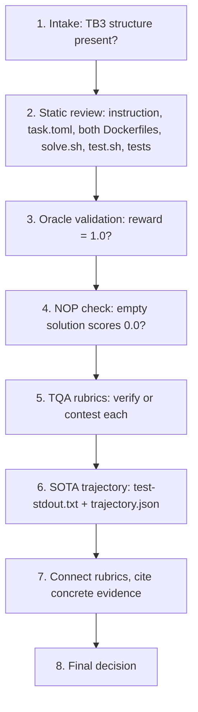

# Terminal Bench 3.0 — Task Review Workflow

A working guide to the reviewer role, distilled from `t30EvalProcess.pdf`.

---

## What you're reviewing

You're a human reviewer for **Terminal Bench 3.0 (TB3)** tasks. A TB3 task is a benchmark problem for coding agents. Each one is a folder with a fixed shape:

- `instruction.md` — the prompt the agent sees (the "contract")
- `task.toml` — metadata, artifacts, timeouts, difficulty/solution/verification explanations
- `environment/` — the Dockerfile for the container the agent works in
- `solution/` — `solve.sh`, the reference ("oracle") solution written by the task author
- `tests/` — the verifier: its own Dockerfile, `test.sh`, and test code

Your deliverable is not a fix to the task. It's an **evidence-backed accept/reject decision plus a written review**. Task authors then use your comments to make it shippable.

The single idea behind every rubric: a good TB3 task must be **hard enough that strong agents genuinely fail, but fair enough that when they fail it's the agent's fault and not the task's**. Almost everything you check is either "is it real work?" or "is the grading honest?"

---

## The two signals you inherit

Before you touch a task, two automated assessments already exist. Treat both as claims to verify, not facts:

| Signal | What it is | Your obligation |
| --- | --- | --- |
| **TQA review** | Each rubric card marked PASS/FAIL with an explanation. Any single FAIL means the task fails TQA review. | Inspect each rubric against the evidence. Contest invalid failures. |
| **Reviewer Agent verdict** | One holistic judgement on the whole task. | Read and evaluate it alongside tests, trajectory, and evidence. Call out unsupported verdicts explicitly. |

You can **contest** either one. If a TQA FAIL is hallucinated, unsupported, factually wrong, or *stricter than the actual TB3 requirement*, record the exact reason and contest it. If the Reviewer Agent verdict is invalid, you must explicitly say so in your review and explain the mismatch. Never rubber-stamp the labels.

---

## The evidence you pull

From the portal's Download menu you get either the **full task package** (task files + QA outputs + Harbor viewer) or **report trajectories only**. The four artifacts that do most of the work:

- **Oracle execution log** — did `solve.sh` run and score reward = 1.0?
- **NOP run** — does an empty/no-op solution score 0.0?
- **`test-stdout.txt`** — exactly which assertion failed in an agent trial
- **`trajectory.json`** — what the agent actually did, step by step

> **Evidence rule:** never decide from one signal. Combine instruction/spec, task files, test behaviour, oracle result, TQA explanation, Reviewer Agent statements, model trajectory, and verifier output together.

---

## The end-to-end loop



1. **Intake and basic structure review** — confirm `instruction.md`, `task.toml`, `environment/`, `solution/`, `tests/` are all present. Check naming, artifact declarations, and obvious file leakage or extraneous files.
2. **Static and configuration review** — read `instruction.md`, `task.toml`, both Dockerfiles, `solve.sh`, `test.sh`, and the test code. Check path declarations, metadata, timeout/resource settings, separate-verifier configuration, and dependency placement.
3. **Oracle validation** — a valid task completes successfully at **reward = 1.0**. If the batch run fails, fail the rubric and reject the task, but still review the remaining rubrics so the author gets a complete report.
4. **NOP / empty-solution sanity check** — a non-trivial task must not pass without doing the work. If NOP passes, the verifier is suspect: investigate whether it's vacuous, always-passing, or otherwise weak.
5. **TQA review and contesting** — review each rubric against the task and evidence. Contest a failure *or a pass* when the explanation is hallucinated, incorrect, unsupported, or stricter than the actual TB3 requirement. Record exact evidence for every contest.
6. **SOTA trajectory review** — the step where most real judgement happens. `test-stdout.txt` tells you *which* assertion broke; `trajectory.json` tells you whether the agent deserved it. This is what distinguishes genuine agent failures from test defects.
7. **Reviewer Portal write-up** — treat rubrics as connected: an instruction gap lowers clarity, lowers coverage, and can create FP/FN issues. Point to concrete evidence and line references.
8. **Final decision** — accept only when solvability, verifier quality, task quality, anti-cheat properties, and the evidence-supported review are all sound.

---

## Pre-review checks

- Task is in TB3 shape: artifacts at the top level and `[verifier].environment_mode = "separate"`.
- `instruction.md` uses **absolute paths**, states every output/path the tests depend on, and has no hidden requirements.
- `environment/Dockerfile` contains only task-runtime dependencies and setup. It must not expose tests, solution files, ground truth, or test-only scoring dependencies.
- `tests/Dockerfile` owns the verifier environment, pre-installs verifier dependencies, and creates parent directories for declared artifacts.
- `tests/test.sh` executes deterministically and writes `reward.txt` **after** verification, not pre-emptively.
  - **The reward file/value generation must happen in `test.sh`, not in `test_outputs.py`.**
- The oracle computes the answer from the task rather than hardcoding or copying a final answer.

---

## File-by-file review

**`instruction.md`** — clear objective, absolute paths, expected outputs/formats, no hidden requirements, concise and human-written. Every tested behaviour should be traceable back to it. Missing requirements later asserted by tests are a **major alignment issue**.

**`task.toml`** — required metadata, top-level artifacts, separate verifier, resources/timeouts, valid category/tags, relevant experience, no invented fields. Artifacts must match what the verifier actually needs, and the timeout stated in the instruction must match the configured timeout.

**`environment/Dockerfile`** — only runtime dependencies and start state; apt hygiene; no test/solution leakage; no ground truth. Any verifier or test asset visible to the agent is a leakage/anti-cheat concern.

**`tests/Dockerfile`** — verifier dependencies installed at build time, tests copied into `/tests`, artifact parent directories created. Missing artifact directories cause upload failures; trial-time installs make verification flaky.

**`tests/test.sh` + tests** — deterministic execution, behaviour-based checks, complete instruction coverage, robust edge cases, reward emitted correctly. Avoid keyword/source grepping, hidden requirements, brittle exact-value checks, and tests that mirror one implementation.

**`solution/solve.sh`** — the reference solution derives the answer; helper scripts belong in `solution/`; the oracle is deterministic and idempotent. A hardcoded answer or copied fixture is a major solvability/oracle-quality concern.

---

## What the 49 rubrics are actually asking

Don't memorize them as a list. They cluster into six questions.

**Is it solvable and is the oracle honest?**
Oracle reaches reward 1.0 (#1), fits the configured time (#5), and *derives* the answer rather than pasting or hardcoding it (#19). Solution produces an outcome the verifier can deterministically validate (#35).

**Is the verifier strong?**
Empty solution fails (#2). Verifier resists adversarial agents (#3) and tests resist shortcuts like copying, hardcoding, or exploiting a test gap (#9). No false positives (#40). No reward-hacking path (#44). Verifier runs in a **separate container** and receives only intended artifacts (#31). `reward.txt` written at the correct point, reflecting the real test result, never pre-emptively (#38) — a pre-written reward can mask timeouts and harness failures.

**Is the grading fair?**
Every test assertion traces to the instruction (#14). Tests grade outcomes, not process (#8), and verify behaviour through **execution** rather than grep/string matching/source scanning (#11). No false negatives from mismatched names, brittle assertions, or spec defects (#41). Adequate coverage of instructed behaviours and meaningful edge cases (#34). Observed failures attributable to the agent, not infra (#42). No typos in identifiers/paths/commands (#21). Timeouts and resources appropriate (#27), with no failures caused purely by low timeout (#48).

**Is the difficulty the right kind?**
Genuinely difficult (#6), difficulty coming from the intended domain challenge rather than formatting or infrastructure accidents (#13), with the crux conceptual and central (#45) and non-clerical (#49). Near misses should be honest capability failures, not almost-correct outputs rejected over minor formatting (#46). Not memorizable from training data (#15). Requires real agent interaction (#16). Interesting / real-world (#7). Plausible expert time estimate (#29).

**Is it clean and deterministic?**
Verifier deterministic and reliable (#4). Task, oracle, and verifier reproducible across runs (#12). Docker/environment hygiene (#39). No extraneous or pre-baked runtime files (#32). Correct task directory structure (#37). `task.toml` follows the Harbor schema, using only required fields in correct sections (#30). Declared input artifacts genuinely contain the conditions or defects the task expects (#36).

**Is it well documented and safe?**
The three `task.toml` explanation fields each have a distinct job: `difficulty_explanation` covers intrinsic difficulty and real-world context (#22); `solution_explanation` gives high-level strategy and insight, **not** a line-by-line script dump (#23); `verification_explanation` says what the tests check, why, and any tolerance choices (#24). Plus meaningful category and tags (#25), a descriptive slug following the 3-word naming constraint (#26), a README that adds context without leaking the solution (#28), reviewability by non-specialists (#17), a concise human-written instruction free of tutorial content (#18), structured output used where it genuinely helps with a clearly specified schema (#20), no malicious or unsafe content (#10), and no unexpected agent refusal patterns (#47).

---

## Rubrics that need extra attention

These carry the most weight because a failure in one cascades into clarity, coverage, FP/FN, or verifier-quality problems elsewhere.

- **Core Challenge is the Actual Problem** — confirm the task is difficult for the intended technical reason, not formatting, ambiguity, or infrastructure noise. Check the observed crux in the trajectory.
- **Tests Align with the Instruction** — every assertion traceable to the contract. Any test-only requirement is a major alignment issue; a spec/test mismatch can cascade into many rubric failures.
- **Instruction Quality** — the agent must have objective, paths, outputs, formats, and constraints. Missing or ambiguous requirements are a common FP/FN root cause.
- **Test Coverage** — essential behaviours and meaningful edge cases covered; look for important paths that can pass untested.
- **Reward File Written Correctly** — written during verification, reflecting the real result, not created pre-emptively in a way that masks timeouts or harness failures.
- **False Negative** — a correct solution must not fail from a spec/test defect. Confirm with the failing assertion + instruction + test code + trajectory.
- **False Positive** — an incorrect solution must not pass from weak or missing assertions. Look for untested paths, hardcoding opportunities, exploitable gaps, and confirm in the trajectory.
- **Task Specification** — enough information to succeed without hidden conventions that appear only in tests.
- **Difficulty Crux** — failures should reflect the intended conceptual challenge, not clerical work or environmental friction.
- **Near Misses / Non-Clerical Difficulty** — near-misses should be genuine capability failures, not almost-correct outputs rejected over minor formatting.

> **Tip:** when one of these fails, check whether the same root cause affects another rubric before writing the final decision.

---

## The FP/FN judgement — the heart of the job

1. For every TQA grading, read the description and compare it with task intent. Do not accept the label automatically. Hallucinated claims or conditions stricter than the actual TB3 requirement are **contest candidates** — record the exact reason.
2. For a model failure, inspect `test-stdout.txt` to identify which assertion failed. Then inspect the corresponding test code and `instruction.md`.
3. Use `trajectory.json` to confirm what the agent actually did. This is the key guardrail against over-strict LLM judging and incorrect FP/FN classification.
4. For FP/FN comments, record the relevant test case or code line range where available, and state whether the issue appeared in the actual trajectory.

> **Decision principle:** a test can be technically correct but still wrong for the task if it enforces an unstated requirement. Conversely, an agent can fail a test legitimately even when the test is well written. The correct classification comes from **contract + test + observed trajectory together**.

---

## Writing review comments

Keep the status fields explicit so the TQA outcome and Reviewer Agent assessment stay distinguishable from your own view. Support each finding with concrete evidence and state the required fix.

```
Review:
TQA Status: <TQA verdict and your feedback about it>
Reviewer Agent Status: <RA verdict and your feedback about it>
My Analysis: <your analysis of the task, whether it should pass or fail>
Evidence for your analysis:
  - <concrete evidence: test case, code line range, trajectory observation>
Final Verdict: ...
Fixes:
  - <recommendations that would make the task shippable>
```

**Worked example — False Negative: FAIL**

> One trial built store-scoped fencing and got correct effect counts, completed, and clean leases. It failed because apply raised `FencedError` on a stale token; the test did not catch that, and one concurrent resume exited 1.
>
> The instruction only requires a no-op for idempotency replay, not for fencing reject. A correct design can still score 0 if the test enforces an unstated requirement.

Avoid vague comments such as "tests are weak" or "instruction is unclear" without describing the exact mismatch.

---

## Final QA gate

Accept only when **all** of the following hold:

- [ ] Oracle passes with reward = 1.0.
- [ ] NOP / empty solution does not pass a non-trivial task.
- [ ] No test or solution leakage into the agent environment.
- [ ] All verifier tests trace to the instruction/spec and grade behaviour, not a single implementation.
- [ ] No material false positives or false negatives remain; any edge case is supported by trajectory/test evidence.
- [ ] Reward is generated correctly and cannot mask timeouts or harness errors.
- [ ] Difficulty is conceptual, realistic, and appropriate, not artificially clerical.
- [ ] Metadata, Dockerfiles, artifacts, paths, timeouts, and task structure meet TB3 requirements.
- [ ] Review comments clearly describe evidence and the required fix.

**Note:** the Reviewer Agent verdict is independently validated against the task and evidence. Any invalid or unsupported verdict by the Reviewer Agent must be explicitly mentioned in your review.
