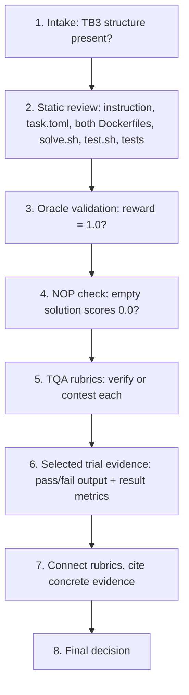

# Terminal Bench 3.0 — Task Review Workflow

A working guide to the reviewer role, distilled from `t30EvalProcess.pdf`.

This is the master review document. The callable instructions in
`.cursor/skills/code-review/SKILL.md` are derived from it. When this workflow
changes, update that skill to match. Invoke the skill manually when starting a
review.

---

## What you're reviewing

You're a human reviewer for **Terminal Bench 3.0 (TB3)** tasks. A TB3 task is a benchmark problem for coding agents. Each one is a folder with a fixed shape:

- `instruction.md` — the prompt the agent sees (the "contract")
- `task.toml` — metadata, artifacts, timeouts, difficulty/solution/verification explanations
- `environment/` — the Dockerfile for the container the agent works in
- `solution/` — `solve.sh`, the reference ("oracle") solution written by the task author
- `tests/` — the verifier: its own Dockerfile, `test.sh`, and test code

Your deliverable is not a fix to the task. It's an **evidence-backed accept/reject decision plus a written review**. Task authors then use your comments to make it shippable.

The single idea behind every rubric: a good TB3 task must be **hard enough that strong agents genuinely fail, but fair enough that when they fail it's the agent's fault and not the task's**. Almost everything you check is either "is it real work?" or "is the grading honest?"

---

## The two signals you inherit

Before you touch a task, two automated assessments already exist. Treat both as claims to verify, not facts:

| Signal | What it is | Your obligation |
| --- | --- | --- |
| **TQA review** | Each rubric card marked PASS/FAIL with an explanation. Any single FAIL means the task fails TQA review. | Inspect each rubric against the evidence. Contest invalid failures. |
| **Reviewer Agent verdict** | One holistic judgement on the whole task. | Read and evaluate it alongside tests and selected trial evidence. Call out unsupported verdicts explicitly. |

You can **contest** either one. If a TQA FAIL is hallucinated, unsupported, factually wrong, or *stricter than the actual TB3 requirement*, record the exact reason and contest it. If the Reviewer Agent verdict is invalid, you must explicitly say so in your review and explain the mismatch. Never rubber-stamp the labels.

---

## The evidence you review

Prepare the evidence once:

```bash
cd code-review
npm run prepare-review -- inbox/<package-or-parent>
```

After that command finishes, review only these outputs:

```text
code-review/out/
  <task>.dossier.md
  <task>.reviewer-agent-findings.md      when present in the package
  <task>/
    reviewer-working-copy/
      instruction.md
      task.toml
      environment/
      solution/
      tests/
    trajectories/
      <model>/
        attempt_NN-pass/
        attempt_NN-fail/
          verifier/test-stdout.txt
          verifier/reward.txt
          result.json
```

The trajectory export keeps one passing attempt per model and every failing attempt. Its `result.json` contains only `agent_result` and `verifier_result`. It does not contain the agent's step-by-step trajectory.

### Review boundary and context budget

The preparation command is the only step allowed to receive an `inbox` path. After it finishes, the evidence boundary is the generated files for that task under `code-review/out/`.

- Do not list, search, open, or inspect `code-review/inbox/`, raw trajectory folders, `harbor-view/`, `run/`, or any other evidence source outside `code-review/out/`.
- Do not load, attach, summarize, or recursively read the entire `out/` folder or the entire task output. Open only the file needed for the current check.
- Do not start with a broad recursive search. Read the dossier headings first. Then open the relevant task file, test, or selected attempt for the current evidence group.
- Read test files one at a time. Follow a concrete assertion or claim to its source instead of loading every file at once.
- Skip duplicate, generated, and unrelated files. A file's presence does not make its contents relevant.
- Treat `data/`, `input/`, `inputs/`, datasets, fixtures, and large artifacts as metadata-only by default. List names, paths, sizes, or schemas when needed. Do not read their contents during the normal review.
- Open data or input content only when a specific criterion cannot be decided otherwise. State the exact edge case first. Read the smallest useful sample or range, never the whole large file.
- Never load binary data or a large data file into model context. Use metadata, a bounded sample, or a targeted structured query.

A normal review should read the dossier selectively, the small task source files needed by the current group, each relevant test, and the retained pass/fail outputs. Context size is not evidence quality.

The four artifacts that do most of the work:

- **The dossier** — all 49 TQA criteria, TQA reasoning, measured trial facts, and failure summaries.
- **The reviewer working copy** — the instruction, task metadata, environment, oracle solution, and verifier files.
- **Reviewer Agent findings** — when present, the complete Reviewer Agent report, copied without rewriting it.
- **Compact trial evidence** — selected pass/fail rewards, verifier output, and result metrics.

> **Evidence rule:** never decide from one signal. Combine instruction/spec, task files, test behaviour, oracle result, TQA explanation, Reviewer Agent statements, selected trial results, and verifier output together.

---

## The end-to-end loop



1. **Intake and basic structure review** — confirm `instruction.md`, `task.toml`, `environment/`, `solution/`, `tests/` are all present. Check naming, artifact declarations, and obvious file leakage or extraneous files.
2. **Static and configuration review** — read `instruction.md`, `task.toml`, both Dockerfiles, `solve.sh`, `test.sh`, and the test code. Check path declarations, metadata, timeout/resource settings, separate-verifier configuration, and dependency placement.
3. **Oracle validation** — a valid task completes successfully at **reward = 1.0**. If the batch run fails, fail the rubric and reject the task, but still review the remaining rubrics so the author gets a complete report.
4. **NOP / empty-solution sanity check** — a non-trivial task must not pass without doing the work. If NOP passes, the verifier is suspect: investigate whether it's vacuous, always-passing, or otherwise weak.
5. **TQA review and contesting** — review each rubric against the task and evidence. Contest a failure *or a pass* when the explanation is hallucinated, incorrect, unsupported, or stricter than the actual TB3 requirement. Record exact evidence for every contest.
6. **Selected trial review** — `test-stdout.txt` tells you which assertion broke. Compare that assertion with the test code and instruction. Use the retained passing attempt as a control. The compact export does not show the agent's steps, so do not claim what the agent thought or implemented unless another retained file proves it.
7. **Reviewer Portal write-up** — treat rubrics as connected: an instruction gap lowers clarity, lowers coverage, and can create FP/FN issues. Point to concrete evidence and line references.
8. **Final decision** — accept only when solvability, verifier quality, task quality, anti-cheat properties, and the evidence-supported review are all sound.

---

## Pre-review checks

- Task is in TB3 shape: artifacts at the top level and `[verifier].environment_mode = "separate"`.
- `instruction.md` uses **absolute paths**, states every output/path the tests depend on, and has no hidden requirements.
- `environment/Dockerfile` contains only task-runtime dependencies and setup. It must not expose tests, solution files, ground truth, or test-only scoring dependencies.
- `tests/Dockerfile` owns the verifier environment, pre-installs verifier dependencies, and creates parent directories for declared artifacts.
- `tests/test.sh` executes deterministically and writes `reward.txt` **after** verification, not pre-emptively.
  - **The reward file/value generation must happen in `test.sh`, not in `test_outputs.py`.**
- The oracle computes the answer from the task rather than hardcoding or copying a final answer.

### `test.sh` reward control flow

Read `tests/test.sh` in execution order. Check all three cases:

1. **Pre-emptive reward generation is a hard fail.** If the script writes a default reward before pytest, such as `echo 0 > /logs/verifier/reward.txt`, mark Reward File Written Correctly as FAIL. A timeout should remain an `AgentTimeoutError`. A pre-written zero hides that timeout and makes it look like a normal test failure.
2. **`set -e` must not skip reward generation.** If `set -e` is active when pytest runs, the script must disable it with `set +e` or use another explicit construct that captures pytest's exit code. Otherwise, a failed test exits the script before `reward.txt` is written. Harbor then reports `RewardFileNotFound`, which hides the actual test result.
3. **Write the reward before the final exit.** The script may end with `exit 0` or with pytest's captured exit code. Either form is acceptable only after `reward.txt` has been written from the completed test result. The shell exit code does not replace the reward file.

For every finding, cite the pytest invocation, the reward write, and the final exit by file and line.

---

## File-by-file review

**`instruction.md`** — clear objective, absolute paths, expected outputs/formats, no hidden requirements, concise and human-written. Every tested behaviour should be traceable back to it. Missing requirements later asserted by tests are a **major alignment issue**.

**`task.toml`** — required metadata, top-level artifacts, separate verifier, resources/timeouts, valid category/tags, relevant experience, no invented fields. Artifacts must match what the verifier actually needs, and the timeout stated in the instruction must match the configured timeout.

**`environment/Dockerfile`** — only runtime dependencies and start state; apt hygiene; no test/solution leakage; no ground truth. Any verifier or test asset visible to the agent is a leakage/anti-cheat concern.

**`tests/Dockerfile`** — verifier dependencies installed at build time, tests copied into `/tests`, artifact parent directories created. Missing artifact directories cause upload failures; trial-time installs make verification flaky.

**`tests/test.sh` + tests** — deterministic execution, behaviour-based checks, complete instruction coverage, robust edge cases, reward emitted correctly. Avoid keyword/source grepping, hidden requirements, brittle exact-value checks, and tests that mirror one implementation.

**`solution/solve.sh`** — the reference solution derives the answer; helper scripts belong in `solution/`; the oracle is deterministic and idempotent. A hardcoded answer or copied fixture is a major solvability/oracle-quality concern.

---

## What the 49 rubrics are actually asking

Do not review them as 49 isolated tasks. Review six evidence groups. Decide the connected criteria together, then name the criterion numbers and IDs covered by each conclusion.

**Is it solvable and is the oracle honest?**
Oracle reaches reward 1.0 (#1), fits the configured time (#5), and *derives* the answer rather than pasting or hardcoding it (#19). Solution produces an outcome the verifier can deterministically validate (#35).

**Is the verifier strong?**
Empty solution fails (#2). Verifier resists adversarial agents (#3) and tests resist shortcuts like copying, hardcoding, or exploiting a test gap (#9). No false positives (#40). No reward-hacking path (#44). Verifier runs in a **separate container** and receives only intended artifacts (#31). `reward.txt` written at the correct point, reflecting the real test result, never pre-emptively (#38) — a pre-written reward can mask timeouts and harness failures.

**Is the grading fair?**
Every test assertion traces to the instruction (#14). The instruction is complete, precise, and free of solution hints (#33), and the task specification gives a capable agent enough information to succeed (#43). Tests grade outcomes, not process (#8), and verify behaviour through **execution** rather than grep/string matching/source scanning (#11). No false negatives from mismatched names, brittle assertions, or spec defects (#41). Adequate coverage of instructed behaviours and meaningful edge cases (#34). Observed failures attributable to the agent, not infra (#42). No typos in identifiers/paths/commands (#21). Timeouts and resources appropriate (#27), with no failures caused purely by low timeout (#48).

**Is the difficulty the right kind?**
Genuinely difficult (#6), difficulty coming from the intended domain challenge rather than formatting or infrastructure accidents (#13), with the crux conceptual and central (#45) and non-clerical (#49). Near misses should be honest capability failures, not almost-correct outputs rejected over minor formatting (#46). Not memorizable from training data (#15). Requires real agent interaction (#16). Interesting / real-world (#7). Plausible expert time estimate (#29).

**Is it clean and deterministic?**
Verifier deterministic and reliable (#4). Task, oracle, and verifier reproducible across runs (#12). Docker/environment hygiene (#39). No extraneous or pre-baked runtime files (#32). Correct task directory structure (#37). `task.toml` follows the Harbor schema, using only required fields in correct sections (#30). Declared input artifacts genuinely contain the conditions or defects the task expects (#36).

**Is it well documented and safe?**
The three `task.toml` explanation fields each have a distinct job: `difficulty_explanation` covers intrinsic difficulty and real-world context (#22); `solution_explanation` gives high-level strategy and insight, **not** a line-by-line script dump (#23); `verification_explanation` says what the tests check, why, and any tolerance choices (#24). Plus meaningful category and tags (#25), a descriptive slug following the 3-word naming constraint (#26), a README that adds context without leaking the solution (#28), reviewability by non-specialists (#17), a concise human-written instruction free of tutorial content (#18), structured output used where it genuinely helps with a clearly specified schema (#20), no malicious or unsafe content (#10), and no unexpected agent refusal patterns (#47).

---

## Rubrics that need extra attention

These carry the most weight because a failure in one cascades into clarity, coverage, FP/FN, or verifier-quality problems elsewhere.

- **Core Challenge is the Actual Problem** — confirm the task is difficult for the intended technical reason, not formatting, ambiguity, or infrastructure noise. Check the failing assertion and compare it with the task's stated crux.
- **Tests Align with the Instruction** — every assertion traceable to the contract. Any test-only requirement is a major alignment issue; a spec/test mismatch can cascade into many rubric failures.
- **Instruction Quality** — the agent must have objective, paths, outputs, formats, and constraints. Missing or ambiguous requirements are a common FP/FN root cause.
- **Test Coverage** — essential behaviours and meaningful edge cases covered; look for important paths that can pass untested.
- **Reward File Written Correctly** — written during verification, reflecting the real result, not created pre-emptively in a way that masks timeouts or harness failures.
- **False Negative** — a correct solution must not fail from a spec/test defect. Confirm with the failing assertion, instruction, test code, and retained trial result.
- **False Positive** — an incorrect solution must not pass from weak or missing assertions. Look for untested paths, hardcoding opportunities, and exploitable gaps. Use the retained passing output as a control, not as proof that every wrong solution fails.
- **Task Specification** — enough information to succeed without hidden conventions that appear only in tests.
- **Difficulty Crux** — failures should reflect the intended conceptual challenge, not clerical work or environmental friction.
- **Near Misses / Non-Clerical Difficulty** — near-misses should be genuine capability failures, not almost-correct outputs rejected over minor formatting.

> **Tip:** when one of these fails, check whether the same root cause affects another rubric before writing the final decision.

---

## The FP/FN judgement — the heart of the job

False positives and false negatives are the core of every review. They decide whether the verifier grades the task honestly. Structure, Docker hygiene, reward handling, and coverage still matter, but they are secondary to whether correct work passes and wrong work fails.

- A **false negative** means a correct solution is rejected because the instruction and verifier disagree, or because a test is buggy or too strict.
- A **false positive** means an incorrect, incomplete, or cheating solution passes because the verifier is weak or can be bypassed.

Do not report "none" for either category until every test and every assertion has been checked. For each assertion, ask both questions:

1. What incorrect result could satisfy this assertion?
2. What correct result could this assertion reject?

An FP/FN finding must be defensible without guesswork. Name the exact test and assertion. Quote or cite the instruction sentence that defines the expected behaviour. Describe the concrete wrong solution that passes or the concrete correct solution that fails. State whether the selected trial evidence demonstrates the issue or whether it is a code-path finding. If the evidence does not support that level of confidence, mark it unverifiable instead of claiming an FP or FN.

1. For every TQA grading, read the description and compare it with task intent. Do not accept the label automatically. Hallucinated claims or conditions stricter than the actual TB3 requirement are **contest candidates** — record the exact reason.
2. For a model failure, inspect `test-stdout.txt` to identify which assertion failed. Then inspect the corresponding test code and `instruction.md`.
3. Compare failing and passing `test-stdout.txt`, `reward.txt`, and the reduced `result.json`. State only what those files prove. Do not infer unseen agent steps.
4. For FP/FN comments, record the relevant instruction and test line ranges. Name the selected attempt where the issue appeared.

> **Decision principle:** a test can be technically correct but still wrong for the task if it enforces an unstated requirement. Conversely, an agent can fail a test legitimately even when the test is well written. The correct classification comes from **contract + test + observed verifier result together**.

---

## Writing review comments

Keep the status fields explicit so the TQA outcome and Reviewer Agent assessment stay distinguishable from your own view. Support each finding with concrete evidence and state the required fix.

Write so another reviewer can read the result cold and defend it:

- Use short sentences. Keep one idea in each sentence.
- Do not use em dashes.
- Use plain words. Write "use", not "utilize". Write "about", not "regarding".
- Say what you opened and what you saw. Use "I" when describing your checks.
- Name the file and line for every task-file claim.
- Explain what happens before naming the rubric it affects.
- Explain what a number means in task terms. Do not report a percentage without its denominator or impact.
- Do not write vague findings such as "tests are weak" or "instruction is unclear".

Write one section for each of the six rubric groups. Do not produce 49 repetitive rows. Within each group:

1. State the conclusion.
2. Name the criterion numbers and IDs covered.
3. Describe the checks once when the criteria share evidence.
4. List only exceptions, disagreements, or criteria that need a separate note.

The grouped review must still account for all 49 criteria. Grouping removes repeated prose. It does not permit skipped criteria.

Return the final review as a plain Markdown document. Do not create a canvas, web page, dashboard, interactive app, or other presentation layer. The Markdown content is the deliverable.

```
Review:
TQA Status: <TQA verdict and your feedback about it>
Reviewer Agent Status: <RA verdict and your feedback about it>
My Analysis: <your analysis of the task, whether it should pass or fail>
Evidence for your analysis:
  - <concrete evidence: test case, code line range, selected attempt result>
Final Verdict: ...
Fixes:
  - <recommendations that would make the task shippable>
```

**Worked example — False Negative: FAIL**

> One trial built store-scoped fencing and got correct effect counts, completed, and clean leases. It failed because apply raised `FencedError` on a stale token; the test did not catch that, and one concurrent resume exited 1.
>
> The instruction only requires a no-op for idempotency replay, not for fencing reject. A correct design can still score 0 if the test enforces an unstated requirement.

Avoid vague comments such as "tests are weak" or "instruction is unclear" without describing the exact mismatch.

---

## Final QA gate

Accept only when **all** of the following hold:

- [ ] Oracle passes with reward = 1.0.
- [ ] NOP / empty solution does not pass a non-trivial task.
- [ ] No test or solution leakage into the agent environment.
- [ ] All verifier tests trace to the instruction/spec and grade behaviour, not a single implementation.
- [ ] No material false positives or false negatives remain; any edge case is supported by task, test, and selected trial evidence.
- [ ] Reward is generated correctly and cannot mask timeouts or harness errors.
- [ ] Difficulty is conceptual, realistic, and appropriate, not artificially clerical.
- [ ] Metadata, Dockerfiles, artifacts, paths, timeouts, and task structure meet TB3 requirements.
- [ ] Review comments clearly describe evidence and the required fix.

**Note:** the Reviewer Agent verdict is independently validated against the task and evidence. Any invalid or unsupported verdict by the Reviewer Agent must be explicitly mentioned in your review.
