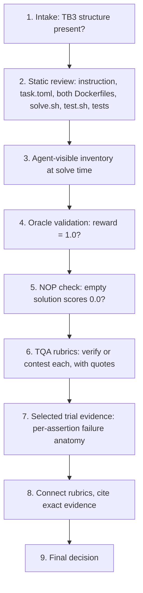

# Terminal Bench 3.0 — Task Review Workflow

A working guide to the reviewer role, distilled from `t30EvalProcess.pdf`.

This is the master review document. The callable instructions in
`.codex/skills/mit-03-code-review/SKILL.md` are derived from it. When this
workflow changes, update that skill to match. Invoke the skill manually when
starting a review.

For the authoritative Harbor rules — the 35 implementation criteria the autoreview
runs, the 6 trial-analysis checks, every static CI check, the `task.toml` schema,
the task folder layout, and how the portal's 49 rubrics map to Harbor's criteria —
see `tb3-harbor-reference.md`. This workflow governs *how the portal is marked*;
that reference is the ground truth for *what Harbor actually checks*, distilled from
the Harbor repo (`docs/REVIEWING.md`, `docs/TASK_REVIEW_AUTOMATION.md`,
`docs/prompts/task-implementation.toml`, `docs/TAXONOMY.md`). Quote rules from it
whenever a finding turns on a rubric bar, a static-check rule, or an automated
result.

---

## What you're reviewing

You're a human reviewer for **Terminal Bench 3.0 (TB3)** tasks. A TB3 task is a
benchmark problem for coding agents. Each one is a folder with a fixed shape:

- `instruction.md` — the prompt the agent sees (the "contract")
- `task.toml` — metadata, artifacts, timeouts, difficulty/solution/verification explanations
- `environment/` — the Dockerfile for the container the agent works in
- `solution/` — `solve.sh`, the reference ("oracle") solution written by the task author
- `tests/` — the verifier: its own Dockerfile, `test.sh`, and test code

Your deliverable is not a fix to the task. It is a saved Markdown report with
**49 evidence-backed rubric ratings, one for every rubric, plus a final task
decision**. Write it to `code-review/out/<task>.human-review.md`. Task authors
then use the report to make the task shippable.

The single idea behind every rubric: a good TB3 task must be **hard enough that
strong agents genuinely fail, but fair enough that when they fail it's the
agent's fault and not the task's**. Almost everything you check is either "is it
real work?" or "is the grading honest?"

---

## Three disciplines that decide whether a review is trusted

Everything below repeats these three. Read them first, because a review that
skips them reads as confident but unverifiable, and a careful reader rejects it.
The reviewer feedback that motivated this document was, every time, one of these
three failures.

### Discipline 1 — Cite the exact text, never paraphrase

A finding is only useful if the reader sees exactly what is present or missing
**without opening a single file**. Never write "the instruction says", "the
test checks", "the spec requires", "the comment notes", or "the tests use X"
and stop there. Follow every such claim with the **verbatim words, in quotation
marks**, and name where they live.

Stop writing this:

> The instruction requires agents to use the checkpoint horizon.
> `read_tuples` ignores `lsn`.
> The tests use horizon 249.

Write this instead:

> `instruction.md`, "Recovered tuples" section, says only: "emit every tuple the
> engine reports as live". It never mentions a checkpoint horizon.
> `read_tuples` builds `tup = (rec["xid"], rec["op"], rec["key"], rec["value"])`
> — four fields; the record's `lsn` never appears in the tuple.
> The value 249 comes from `HORIZON = last_checkpoint_lsn - 1` in
> `tests/gen_data.py`, quoted below; it appears in no agent-visible file.

This applies to instruction clauses, test assertions and comparisons, code
comments, schema and field definitions, the three `task.toml` explanation
fields, and any number you cite — for a number, quote or name the exact line
that produces it. One short quote per point is enough: quote the load-bearing
phrase, not the whole paragraph. Quoting the task's own instruction, tests, and
code is required and expected; the copyright limit is about external copyrighted
works, not the files under review.

Every `Evidence` bullet must contain either a verbatim quote or a named symbol
whose exact text you already quoted in the `Reason`. "Looks fine", "the tests
are thorough", and "the instruction is clear" are not evidence. Always use the
real name of every test, file, and variable — never a placeholder like "test G"
or "tests B, C, and G".

### Discipline 2 — The solve-time visibility test (the load-bearing-rule check)

Every rule the verifier enforces must be a rule the agent could have known.
Before you accept **Tests Align with the Instruction (#14)**, **Task
Specification (#43)**, **No False Negatives (#41)**, or **Instruction Quality
(#33)**, run this test for each load-bearing rule the verifier enforces:

1. **Name the enforced rule**, quoting the exact assertion or comparison that
   enforces it (Discipline 1).
2. **Find where the rule is declared.** Trace it to one of: the instruction
   (quote the clause), or a file the agent can read in its container at solve
   time (name the file, quote the relevant text).
3. **Confirm the file is actually present at solve time.** A file the verifier
   uses, or that generates the test data, is *not* automatically agent-visible.
   Read `environment/Dockerfile` and every setup script and trace each `COPY`,
   `ADD`, `RUN`, and `rm`. A file that is generated and then deleted before the
   agent starts, or that is copied only into the `tests/` image, is **not**
   available to the agent. State in words what the agent can and cannot read the
   moment it begins.
4. **Classify the rule:**
   - **Derivable** — stated in the instruction or in an agent-visible file.
     Enforcing it is fair.
   - **Not derivable** — the rule lives only in a verifier-only file, a
     deleted-before-start file, or verifier-only data generation, and nothing
     the agent can see implies it. Enforcing it is a **false negative and an
     instruction-test alignment defect, and it blocks the task.**

State the outcome explicitly for every load-bearing rule, quoting both the
enforcing assertion and the declaring text — or recording that the declaring
text does not exist. "The rule is in the instruction" is not acceptable without
the quote. "The agent could infer it" is not acceptable without naming the exact
visible line the inference starts from and explaining why the inference is
**unique** rather than one of several defensible readings.

This is exactly the check a reviewer asks for when they write "point to the
exact instruction text that tells agents to use the checkpoint horizon rather
than the visible `Engine.is_live` behavior" and "verify whether `gen_data.py`
is available to the agent at solve time; if it is deleted before agent start and
contains the rule the verifier uses, the task specification may be missing a
load-bearing rule."

### Discipline 3 — Explain failing trials assertion by assertion

Do not report a trial count and stop. "16 trials failed" is not a finding. For
each **distinct failing assertion**, give:

1. **The failing assertion**, quoted, with the file and function it lives in.
2. **The concrete failing values** — which records, tuples, keys, or fields
   differ, with the expected value and the produced value. Name the specific
   cases ("tuples 51 and 145"), never "some tuples".
3. **The expected logic and where it is defined** — quote it, and run the
   solve-time visibility test (Discipline 2) on it.
4. **The logic an agent would infer** from the agent-visible code and
   instruction — state what a solution that is correct by the *visible* contract
   produces for those same cases.
5. **The verdict** — is the expectation derivable from agent-visible material?
   If yes, the failures are genuine agent errors. If no, they are false
   negatives. Give the split with counts: "14 of 16 failures are the
   non-derivable horizon rule; 2 are genuine agent errors on tuple ordering."

Convergent failures at the same value across independent trials are evidence of
a reliably triggered condition, not of agent variance. Whether that condition is
a *fair* trap or an *unfair* one is exactly what steps 3 to 5 decide, and you
cannot decide it without Disciplines 1 and 2.

---

## Rating rules and calibration

### Rate from evidence; do not over-fail

Your job is to rate each rubric accurately, not to find something wrong. A
well-built task PASSes most or all rubrics, and PASS is the correct outcome when
the evidence supports it. You have full visibility of the task, so judge each
rubric against its own stated bar (the TQA review file prints it) and never invent a
stricter standard. Mark FAIL or MOD only when a concrete defect is proven from
the evidence. Reserve `REJECT` for a real blocker that survives the second pass,
and do not stack minor concerns into a rejection. Do not hunt for a reason to
fail: if a rubric is genuinely fine, mark it PASS with a short reason and move on.
A genuine failure is fine to mark; a manufactured one is not.

### The portal takes only PASS or FAIL

The rubric vocabulary is PASS, FAIL, LOW, and MOD, but the portal accepts only
PASS or FAIL. Whenever a rating is not a bare PASS or FAIL, append the
submittable verdict in brackets, and that bracket is what the human enters in the
portal: `MOD (PASS)`, `MOD (FAIL)`, `LOW (PASS)`, or `LOW (FAIL)`. A MOD or LOW
that does not block shipping resolves to `(PASS)`; one that blocks shipping
resolves to `(FAIL)`. Every non-PASS/FAIL rating must carry one.

### Solve rate and runtime belong to specific rubrics only

Trial solve rate and trial runtime judge whether the task fits its time and
resources: Task is Solvable in Reasonable Time (#5), Timeouts and Resources are
Appropriate (#27), and Low Timeout (#48). They are also evidence for the rubrics
that read agent *failures* — Core Challenge (#13), Difficulty Crux (#45), Near
Misses (#46), and Failure is Agent Fault (#42) — but only when trials actually
fail, because those rubrics are about how honest agents fail. If no honest trial
failed, there is no failure pattern to judge: do not manufacture one from
runtime, and rate those rubrics PASS unless source evidence contradicts the
intended crux.

Do **not** use solve rate or runtime to fail these:

- **Task is Genuinely Difficult (#6)** — the rubric asks only whether difficulty
  comes "from the problem, reasoning, diagnosis, or environment and not
  artificial clerical burden". A fast solve, a high solve rate, or an instruction
  that states the diagnosis does not make a task clerical and is not grounds to
  fail #6. Fail #6 only when the real work is clerical: renaming, reformatting,
  boilerplate, or repetitive edits with no reasoning.
- **Expert Time Estimate is Plausible (#29)** — a large or generous estimate is
  fine. Never fail #29 for being too high, no matter how large. Only note a
  concern if the estimate is implausibly low for genuine difficulty, and be
  lenient even then.
- **Non-Clerical Difficulty (#49)** — asks the same source-of-difficulty question
  as #6, not how long a model took.

### A missing TQA verdict is not a TQA failure

TQA does not run every rubric on every task. When SOTA models pass all 16 trials,
the 7 rubrics produced by the Harbor Analyze job — the failure-analysis rubrics
that need a failing trial to evaluate — are intentionally left unevaluated. README
Provides Context (#28) and Uses Structured Output When Appropriate (#20) also
usually stay unevaluated on purpose in any case. A `No verdict`, blank, or
`UNEVALUATED` TQA result on these means the rubric was **not run**, not that TQA
failed it. Record it as `No verdict (not run on purpose)` in `TQA review`, never
as a TQA FAIL, and never contest a failure that does not exist. You still produce
your own rating with full reasoning and evidence for every one of the 49,
whatever the SOTA result.

---

## The review roles

The report must keep these layers separate:

| Layer | What it contains | How to use it |
| --- | --- | --- |
| **TQA review** | TQA's original PASS, FAIL, LOW, MOD, or missing result and its explanation for each rubric. | Report what TQA checked. Point out wrong or unsupported claims in the reason, quoting the evidence that contradicts it. Do not invent a second TQA decision field. |
| **Reviewer Agent review** | A separate automated review of the same task. It is not more authoritative than TQA and is not part of the portal decision rule. | Read it as an optional source of leads. Check useful leads against primary evidence. Do not use its statements as evidence or put them inside criterion blocks. |
| **Human review** | Your audit of each TQA criterion against the rubric and primary task evidence. | Give each rubric a `PASS`, `FAIL`, `LOW`, or `MOD` rating. Reserve `ACCEPT` or `REJECT` for the final task decision. |

The 49 human decisions follow one chain: TQA finding, rubric definition, primary
task evidence, human decision. Primary evidence means the instruction, task
files, tests, oracle and control results, and selected trial results. The
Reviewer Agent may suggest a check, but its statement is never proof and must not
change a decision unless the primary evidence independently establishes the same
issue. Never use agent agreement, disagreement, confidence, or silence as a
voting mechanism.

Before reviewing the six evidence groups, skim the Reviewer Agent report and make
a short internal lead list. A lead names a concrete file, test, behavior, metric,
FP/FN risk, or instruction mismatch worth checking. Do not copy its conclusions
into the human review. As primary evidence is inspected, mark each relevant lead:

- `confirmed` — primary evidence independently proves the claim. It may affect a
  human decision, but cite the primary evidence, not the agent.
- `refuted` — primary evidence contradicts the claim. Do not use it.
- `not checked` — it was not needed or the prepared evidence could not settle it.
  It must not affect a human decision.

Reviewer Agent leads are a coverage aid. They change what the human checks; they
never directly change what the human marks.

---

## The evidence you review

Prepare the evidence once:

```bash
cd code-review
npm run prepare-review -- inbox/<package-or-parent>
```

After that command finishes, review only these outputs:

```text
code-review/out/
  <task>.tqa-review.md
  <task>.reviewer_agent.md      when present in the package
  <task>/
    reviewer-working-copy/
      instruction.md
      task.toml
      environment/
      solution/
      tests/
    trajectories/
      <model>/
        attempt_NN-pass/
        attempt_NN-fail/
          verifier/test-stdout.txt
          verifier/reward.txt
          result.json
```

The trajectory export keeps one passing attempt per model and every failing
attempt. Its `result.json` contains only `agent_result` and `verifier_result`.
It does not contain the agent's step-by-step trajectory.

### Review boundary and context budget

The preparation command is the only step allowed to receive an `inbox` path.
After it finishes, the evidence boundary is the generated files for that task
under `code-review/out/`.

- Do not list, search, open, or inspect `code-review/inbox/`, raw trajectory
  folders, `harbor-view/`, `run/`, or any other evidence source outside
  `code-review/out/`.
- Do not load, attach, summarize, or recursively read the entire `out/` folder
  or the entire task output. Open only the file needed for the current check.
- Do not start with a broad recursive search. Read the TQA review file headings first.
  Then open the relevant task file, test, or selected attempt for the current
  group.
- Read test files one at a time. Follow a concrete assertion or claim to its
  source instead of loading every file at once.
- Skip duplicate, generated, and unrelated files. A file's presence does not
  make its contents relevant.
- Treat `data/`, `input/`, `inputs/`, datasets, fixtures, and large artifacts as
  metadata-only by default. List names, paths, sizes, or schemas when needed. Do
  not read their contents during the normal review.
- Open data or input content only when a specific criterion cannot be decided
  otherwise. State the exact edge case first. Read the smallest useful sample or
  range, never the whole large file.
- Never load binary data or a large data file into model context. Use metadata,
  a bounded sample, or a targeted structured query.
- Inventory and open every non-data task file: all root files and every source,
  script, note, configuration, and text document under `solution/`,
  `environment/`, and `tests/`. Review each file for every rubric it can affect,
  not only leakage. Suspicious filenames affect review order only; they never
  limit the files inspected.

A normal review reads the TQA review file selectively, the small task source files needed
by the current group, each relevant test, and the retained pass/fail outputs.
Context size is not evidence quality.

The four artifacts that do most of the work:

- **The TQA review file** — all 49 TQA criteria, TQA reasoning, measured trial facts, and
  failure summaries.
- **The reviewer working copy** — the instruction, task metadata, environment,
  oracle solution, and verifier files. This is where you get the verbatim text
  Discipline 1 requires; quote from here, not from the TQA review file's paraphrase.
- **Reviewer Agent findings** — when present, the complete Reviewer Agent report,
  copied without rewriting it.
- **Compact trial evidence** — selected pass/fail rewards, verifier output, and
  result metrics.

> **Evidence rule:** audit the TQA explanation against the rubric and primary
> evidence. Combine the instruction/spec, task files, test behavior, oracle
> result, controls, selected trial results, and verifier output. Reviewer Agent
> statements are secondary leads, not evidence for a human decision. Every claim
> carries the verbatim text it rests on.

---

## The end-to-end loop



1. **Intake and basic structure review** — confirm `instruction.md`, `task.toml`,
   `environment/`, `solution/`, `tests/` are all present. Check naming and
   artifact declarations.
2. **Static and configuration review** — read `instruction.md`, `task.toml`, both
   Dockerfiles, `solve.sh`, `test.sh`, and the test code. Check path
   declarations, metadata, timeout/resource settings, separate-verifier
   configuration, and dependency placement.
3. **Agent-visible inventory at solve time** — build the exact list of what the
   agent can read the moment it starts, by tracing every `COPY`, `ADD`, `RUN`,
   and `rm` in `environment/Dockerfile` and setup scripts. This inventory feeds
   both the solution-leakage audit and the solve-time visibility test
   (Discipline 2). Do not limit it to obvious test or solution filenames.
4. **Oracle validation** — a valid task completes at **reward = 1.0**. If the
   batch run fails, fail the rubric and reject the task, but still review the
   remaining rubrics so the author gets a complete report.
5. **NOP / empty-solution sanity check** — a non-trivial task must not pass
   without doing the work. If NOP passes, the verifier is suspect: investigate
   whether it is vacuous, always-passing, or otherwise weak.
6. **TQA review and contesting** — review each rubric against the task and
   evidence. Contest a failure *or a pass* when the explanation is hallucinated,
   incorrect, unsupported, or stricter than the actual TB3 requirement. Record
   exact quoted evidence for every contest.
7. **Selected trial review** — `test-stdout.txt` tells you which assertion broke.
   Apply the failing-trial anatomy (Discipline 3): concrete values, expected
   logic, agent-inferable logic, derivability verdict. Use the retained passing
   attempt as a control. The compact export does not show the agent's steps, so
   do not claim what the agent thought or implemented unless a retained file
   proves it.
8. **Reviewer Portal write-up** — treat rubrics as connected: an instruction gap
   lowers clarity, lowers coverage, and can create FP/FN issues. Point to
   concrete, quoted evidence.
9. **Final decision** — accept only when solvability, verifier quality, task
   quality, anti-cheat properties, and the evidence-supported review are all
   sound, and every load-bearing verifier rule passed the solve-time visibility
   test.
10. **Second pass** — revalidate the blockers against their own evidence for
    correctness, right-evidence, and plain-language clarity, then write
    `<task>.human-review-2.md` with only the FAIL blocks and the final
    `Review:` block; mark any you change with `🔁`. See "Second pass" below.

---

## Pre-review checks

- Task is in TB3 shape: artifacts at the top level and
  `[verifier].environment_mode = "separate"`.
- `instruction.md` uses **absolute paths**, states every output/path the tests
  depend on, and has no hidden requirements.
- `environment/Dockerfile` contains only task-runtime dependencies and setup. It
  must not expose tests, solution files, ground truth, or test-only scoring
  dependencies.
- `tests/Dockerfile` owns the verifier environment, pre-installs verifier
  dependencies, and creates parent directories for declared artifacts.
- `tests/test.sh` executes deterministically and writes `reward.txt` **after**
  verification, not pre-emptively.
  - **The reward file/value generation must happen in `test.sh`, not in
    `test_outputs.py`.**
- The oracle computes the answer from the task rather than hardcoding or copying
  a final answer.

### Agent-visible inventory and solution-leakage audit

This check is mandatory and it is the same inventory the solve-time visibility
test (Discipline 2) depends on. A clean Dockerfile is not enough. Inventory
everything the agent can read at task start by tracing every `COPY`, `ADD`,
`RUN`, generated file, mounted input, deletion (`rm`), and pre-existing
work-directory file from `environment/Dockerfile`, the prepared environment tree,
and any setup script.

Two questions come out of this one inventory:

- **Leakage (too much visible):** does an agent-visible file hand the agent
  knowledge it was supposed to derive?
- **Missing rule (not visible enough):** does the verifier enforce a rule that
  lives only in a file the agent *cannot* see at solve time? That is the
  load-bearing-rule defect from Discipline 2.

Open and inspect every agent-visible non-data file, regardless of its name or
extension: root files, source, notes, reports, helpers, examples, configuration,
generated text, and anything copied from `solution/`, `environment/`, or
elsewhere into the agent image. Names such as `prior_*`, `analysis*`,
`analyst_notes*`, `notes*`, `reference*`, `expected*`, `answer*`, and `solution*`
are search hints only. They do not define the scope. An ordinary filename can
contain the same leak.

For leakage, compare every agent-visible non-data file with the instruction,
oracle, and verifier. Check for:

1. near-complete algorithms, canonicalization or reconciliation logic;
2. hidden output keys, schemas, expected values, constants, or bucket rules;
3. comments that identify remaining bugs or the exact fixes needed;
4. copied oracle functions or verifier-specific edge cases;
5. intermediate outputs that let the agent reconstruct the answer without doing
   the intended work.

For each leak, quote the leaking text, state the agent-visible path, what
knowledge it reveals, how much of the intended reasoning it replaces, and which
shortcut it enables. Files such as `/app/prior_analysis.py` and
`/app/analyst_notes.md` are blocking leaks when they expose near-complete logic,
hidden output keys, or the remaining fixes. This affects anti-cheat robustness
(#3), shortcut resistance (#9), core challenge (#13), no extraneous files (#32),
and false-positive protection (#40) as applicable.

The prepared review evidence must include the complete agent-visible file list
and every text file copied into the agent image. If it does not, record a review
preparation gap and do not claim that leakage checks passed. Missing prepared
evidence is not itself proof that the task leaks, but it prevents an `ACCEPT`
based on an assumed clean environment.

### Full non-data source audit

Leakage is one part of the review, not the only reason to inspect files. Open
every non-data file in the prepared task working copy:

- root files, including the instruction, task metadata, READMEs, notes, and
  helper documents;
- every file under `solution/`, including `solve.sh`, implementation files,
  helper modules, templates, and generated text;
- every file under `environment/`, including the Dockerfile, setup scripts,
  copied source, notes, and non-data assets;
- every file under `tests/`, including the Dockerfile, `test.sh`, test modules,
  helpers, configuration, non-data fixtures, and any **data-generation script**.
  A data-generation script is where load-bearing rules most often hide; read it
  and check whether the agent can see it (Discipline 2).

Classify each file by the rubrics it can affect. Solution files can affect oracle
honesty, hardcoding, determinism, and leakage. Environment files can affect agent
visibility, dependencies, reproducibility, safety, and runtime behavior. Test
files can affect alignment, coverage, FP/FN, anti-cheat, reward handling, and
failure attribution. Root notes and helpers can affect specification, extraneous
files, leakage, difficulty, and shortcuts.

Skip the contents of `data/`, `input/`, `inputs/`, datasets, and large fixtures
by default. Still inspect their names, paths, sizes, schemas, generation code,
and how source or tests consume them. Read a bounded sample only when a concrete
criterion or edge case requires it.

### `test.sh` reward control flow

Read `tests/test.sh` in execution order. Check all three cases, and quote the
relevant line for each:

1. **Pre-emptive reward generation is a hard fail.** If the script writes a
   default reward before pytest, such as `echo 0 > /logs/verifier/reward.txt`,
   mark Reward File Written Correctly as FAIL. A timeout should remain an
   `AgentTimeoutError`. A pre-written zero hides that timeout and makes it look
   like a normal test failure.
2. **`set -e` must not skip reward generation.** If `set -e` is active when
   pytest runs, the script must disable it with `set +e` or use another explicit
   construct that captures pytest's exit code. Otherwise a failed test exits the
   script before `reward.txt` is written, Harbor reports `RewardFileNotFound`,
   and the real test result is hidden.
3. **Write the reward before the final exit.** The script may end with `exit 0`
   or with pytest's captured exit code. Either is acceptable only after
   `reward.txt` has been written from the completed test result. The shell exit
   code does not replace the reward file.

For every finding, quote the pytest invocation, the reward write, and the final
exit, and explain their order and effect. Do not make the reader follow line
numbers.

---

## File-by-file review

**`instruction.md`** — clear objective, absolute paths, expected
outputs/formats, no hidden requirements, concise and human-written. Every tested
behavior should be traceable back to it *by quoted clause* (Discipline 2).
Missing requirements later asserted by tests are a **major alignment issue**.

**`task.toml`** — required metadata, top-level artifacts, separate verifier,
resources/timeouts, valid category/tags, relevant experience, no invented
fields. Artifacts must match what the verifier actually needs, and the timeout
stated in the instruction must match the configured timeout.

**`environment/Dockerfile`** — only runtime dependencies and start state; apt
hygiene; no test/solution leakage; no ground truth. This is the primary source
for the agent-visible inventory: trace every `COPY`, `ADD`, `RUN`, and `rm`.

**`tests/Dockerfile`** — verifier dependencies installed at build time, tests
copied into `/tests`, artifact parent directories created. Anything copied here
and nowhere the agent can reach is verifier-only; a rule that lives only here is
a load-bearing-rule candidate.

**`tests/test.sh` + tests + data generation** — deterministic execution,
behavior-based checks, complete instruction coverage, robust edge cases, reward
emitted correctly. A data-generation script (for example `gen_data.py`) often
encodes the true expected-value rule; check whether it is agent-visible. Avoid
keyword/source grepping, hidden requirements, brittle exact-value checks, and
tests that mirror one implementation.

**`solution/solve.sh`** — the reference solution derives the answer; helper
scripts belong in `solution/`; the oracle is deterministic and idempotent. A
hardcoded answer or copied fixture is a major solvability/oracle-quality concern.

---

## What the 49 rubrics are actually asking

Do not review them as 49 isolated tasks. Review six evidence groups. Decide the
connected criteria together, then name the criterion numbers and IDs covered by
each conclusion.

**Is it solvable and is the oracle honest?**
Oracle reaches reward 1.0 (#1), fits the configured time (#5), and *derives* the
answer rather than pasting or hardcoding it (#19). Solution produces an outcome
the verifier can deterministically validate (#35).

**Is the verifier strong?**
Empty solution fails (#2). Verifier resists adversarial agents (#3) and tests
resist shortcuts like copying, hardcoding, or exploiting a test gap (#9). No
false positives (#40). No reward-hacking path (#44). Verifier runs in a
**separate container** and receives only intended artifacts (#31). `reward.txt`
written at the correct point, reflecting the real test result, never
pre-emptively (#38).

**Is the grading fair?**
Every test assertion traces to the instruction by quoted clause (#14). The
instruction is complete, precise, and free of solution hints (#33), and the task
specification gives a capable agent enough information to succeed (#43) — which
requires that no load-bearing rule live only in a verifier-only or
deleted-before-start file. Tests grade outcomes, not process (#8), and verify
behavior through **execution** rather than grep/string matching/source scanning
(#11). No false negatives from mismatched names, brittle assertions, or spec
defects (#41). Adequate coverage of instructed behaviors and meaningful edge
cases (#34). Observed failures attributable to the agent, not infra (#42). No
typos in identifiers/paths/commands (#21). Timeouts and resources appropriate
(#27), with no failures caused purely by low timeout (#48).

**Is the difficulty the right kind?**
Difficulty comes from real problem, reasoning, diagnosis, or environment rather
than artificial clerical burden (#6) — judge the *source* of difficulty, not the
solve rate or runtime. Difficulty in the agent trials reflects the intended
domain challenge rather than formatting or infrastructure accidents (#13), with
the crux conceptual and central and read from how honest agents fail (#45), and
non-clerical (#49). Near misses should be honest capability failures, not
almost-correct outputs rejected over minor formatting (#46). Not memorizable from training data (#15). Requires real agent interaction
(#16). Interesting / real-world (#7). Plausible expert time estimate (#29).

**Is it clean and deterministic?**
Verifier deterministic and reliable (#4). Task, oracle, and verifier reproducible
across runs (#12). Docker/environment hygiene (#39). No extraneous or pre-baked
runtime files (#32). Correct task directory structure (#37). `task.toml` follows
the Harbor schema (#30). Declared input artifacts genuinely contain the
conditions or defects the task expects (#36).

**Is it well documented and safe?**
The three `task.toml` explanation fields each have a distinct job:
`difficulty_explanation` covers intrinsic difficulty and real-world context
(#22); `solution_explanation` gives high-level strategy and insight, **not** a
line-by-line script dump (#23); `verification_explanation` says what the tests
check, why, and any tolerance choices (#24). Plus meaningful category and tags
(#25), a descriptive slug following the 3-word naming constraint (#26), a README
that adds context without leaking the solution (#28), reviewability by
non-specialists (#17), a concise human-written instruction free of tutorial
content (#18), structured output used where it genuinely helps with a clearly
specified schema (#20), no malicious or unsafe content (#10), and no unexpected
agent refusal patterns (#47).

---

## Rubrics that need extra attention

These carry the most weight because a failure in one cascades into clarity,
coverage, FP/FN, or verifier-quality problems elsewhere. Every one of them
requires Discipline 1 quoting, and the first four require the Discipline 2
solve-time visibility test.

- **Tests Align with the Instruction** — every assertion traceable to a *quoted*
  contract clause. A test-only requirement is a major alignment issue and
  cascades. Run the solve-time visibility test on each enforced rule.
- **Task Specification** — enough information to succeed without hidden
  conventions that appear only in tests or in files the agent cannot read.
- **False Negative** — a correct solution must not fail from a spec/test defect.
  Prove it with the failing-trial anatomy (Discipline 3).
- **Instruction Quality** — the agent must have objective, paths, outputs,
  formats, and constraints, quoted. Missing or ambiguous requirements are a
  common FP/FN root cause.
- **Core Challenge is the Actual Problem** — the task is difficult for the
  intended technical reason, not formatting, ambiguity, or infrastructure noise.
- **Test Coverage** — essential behaviors and meaningful edge cases covered; look
  for important paths that can pass untested.
- **Reward File Written Correctly** — written during verification, reflecting the
  real result, not pre-emptively.
- **False Positive** — an incorrect solution must not pass from weak or missing
  assertions. Name the exact wrong solution and quote the assertions it still
  passes. Use the retained passing output as a control, not as proof that every
  wrong solution fails.
- **Difficulty Crux / Near Misses / Non-Clerical Difficulty** — failures reflect
  the intended conceptual challenge, not clerical work or environmental friction;
  near misses are genuine capability failures, not almost-correct outputs
  rejected over minor formatting.

> **Tip:** when one of these fails, check whether the same root cause affects
> another rubric before writing the final decision.

---

## The FP/FN judgement — the heart of the job

False positives and false negatives decide whether the verifier grades the task
honestly. Structure, Docker hygiene, reward handling, and coverage matter, but
they are secondary to whether correct work passes and wrong work fails.

- A **false negative** means the verifier rejects a solution that follows the
  written instruction — or that follows the only rules the agent could see. The
  most common cause is a load-bearing rule that lives only in a verifier-only or
  deleted-before-start file (Discipline 2).
- A **false positive** means the verifier accepts a solution that does not do the
  required work.

Do not report "none" for either category until every test and assertion has been
checked. For each assertion, ask both questions:

1. What incorrect result could satisfy this assertion?
2. What correct result could this assertion reject?

Write every FP/FN finding so a colleague can repeat the explanation without
opening the whole report, and so that a skeptical reader cannot ask "where does
it say that?" Use this order, quoting at each step:

1. **Expected behavior** — quote what the instruction requires or permits, or
   record that it says nothing.
2. **Verifier behavior** — name and quote the test function and the assertion or
   comparison.
3. **Solve-time visibility** — for an FN, state whether the enforced rule is
   derivable from agent-visible material, naming and quoting the declaring file
   or its absence (Discipline 2).
4. **Concrete counterexample** — the wrong solution that passes (FP), or the
   compliant/visible-contract solution that fails (FN), with the specific values.
5. **Why the result is wrong** — connect the counterexample to the missing,
   over-strict, mismatched, or non-derivable check.
6. **Proof level** — say whether a selected attempt demonstrates it (give the
   failing-trial anatomy) or source inspection proves only that the path is
   possible.
7. **Fix** — the smallest test or instruction change that closes the gap.

Do not stop at "hardcoding can pass" or "a correct solution can fail." Name the
values that could be hardcoded, the inputs the verifier never varies, the extra
field or valid format it rejects, and the test function responsible. If the
evidence cannot support that detail, do not claim an FP or FN. Record what
evidence is missing and rate the rubric only from what primary evidence proves.

> **Decision principle:** a test can be technically correct but still wrong for
> the task if it enforces an unstated or non-derivable requirement. Conversely,
> an agent can fail a test legitimately even when the test is well written. The
> correct classification comes from **contract + solve-time visibility + test +
> observed verifier result together**.

---

## Writing review comments

Keep TQA, Reviewer Agent, and human review separate. Base the 49 human decisions
only on the TQA criterion, its rubric definition, and primary task evidence.
Support each decision with quoted evidence and state a fix when the rating is not
`PASS`.

The finding work and the writing work are separate jobs. A correct finding
written at four times the needed length reads as machine output, and the reader
rejects the presentation before judging the finding. Write the way a senior
reviewer fills in a form: state the finding, quote the load-bearing text, show
the number, stop.

### Voice

- Two or three short sentences per point. If two sentences settle it, do not
  write five.
- **Every block stands alone for a non-expert.** A reader who sees only that one
  block must understand what is wrong and why, and think "I see what is
  happening." Do not assume they read the other 48 blocks.
- **Name the thing; never leave a bare pointer.** Do not write "the contract",
  "those details", "it also states", or "this behavior" without immediately
  saying which contract, which details, what it states. A quote does not replace
  naming what the quote is.
- **Never use placeholder labels. (Important.)** Never relabel a test, file,
  assertion, or item as "A", "B", "C", "test G", "the first test", "Test 1", or
  "item 2". Always use its real name: the actual test function
  (`test_decode_matches_reference`), file, variable, or assertion. When you mean
  several, name each one — "`test_decode_matches_reference`,
  `test_restart_exactly_once`, and `test_in_flight_commit_after_restart`", never
  "tests B, C, and G". An outside reader must follow the whole review without ever
  opening the codebase; invented labels make that impossible.
- **Gloss or cut jargon.** Explain every technical term in plain English the
  first time, and cut any technical detail that does not help explain the
  finding. A phrase like "float64 accumulation and copying buffers from the
  latest checkpoint" means nothing to the reader on its own: say what it is and
  why it matters, or leave it out.
- **Clarity beats polish.** Plain, even slightly imperfect English is fine; dense
  precise-but-opaque English is not. Do not make the reader decode the sentence.
- **Use the simplest words, everywhere.** Write every reason and explanation in
  very simple, everyday English. No big or fancy words when a plain one works:
  "use" not "utilize", "show" not "demonstrate", "enough" not "sufficient", "so"
  not "therefore", "leaves out" not "omits". Short words, short sentences. A
  reader should understand each sentence on the first read with no effort. Keep
  the quoted symbol, but explain it in plain words.
- **Do not write like an AI. (Important.)** The review must read like a busy human
  engineer typed it, not a model. Cut AI-tell words: "delve", "leverage",
  "utilize", "robust", "crucial", "seamless", "comprehensive", "meticulous",
  "furthermore", "moreover", "notably", "it's worth noting", "it is important to
  note", "that said", "in essence", "underscores", "highlights". Cut AI sentence
  shapes: the "not only X but also Y" frame, the rule-of-three list used for
  rhythm ("clear, precise, and complete"), the hedge-then-pivot ("while X, it is
  also Y"), and the tidy summarizing closer at the end of a block. Say the thing
  once, plainly, and stop. If a sentence sounds like marketing or like a model
  wrapping up, rewrite it.
- **No internal or tool words in the review.** State facts and sources the way a
  person would. Never write "TQA review file", "dossier", "reviewer-working-copy",
  "trajectory export", "the export", an `out/...` path, or a command name in a
  Reason, Evidence bullet, or the final block. Name the instruction, the tests by
  function name, the oracle, and the trials in natural English; call the automated
  reviews "TQA" and "the Reviewer Agent". For a measured number, state the number
  and what it means, not where it was recorded: write "the no-op solution scored
  0", not "the TQA review file records no-op reward 0".
- **Quote the load-bearing text (Discipline 1).** A short verbatim quote is not
  "colour"; it is the finding. Never paraphrase the instruction, an assertion, or
  a comment when the exact words are what prove the point. Then say in plain words
  what the quote means and why it passes or fails: the quote is the proof, the
  plain sentence is the explanation.
- No process narration in the criterion blocks. Do not write "I read", "I
  opened", "I diffed", "I traced the whole reward path", or "I checked every
  assertion". Say what the file or test does. Keep "I" for the final block, where
  a judgement is being owned.
- No colour and no rhetorical flourish beyond the quotes the finding needs. Write
  "the difference was 0.0004 against a 0.0001 bound". Do not write "four
  hundredths of one cent". Translate a number into task units once, where it
  first matters, and never repeat that phrasing later.
- No sub-headings inside `Reason`. Do not write "What the contract permits:" or
  "Why the result is wrong:". Those are thinking scaffolds, not prose.
- No hedging pairs such as "well built and worth shipping once the precision
  contract is closed". Give the rating and the reason for it.
- Plain declarative sentences. `The instruction's "Output" section says "X". It
  never states Y. The verifier's test_z enforces Y. All eight trials failed on
  it.`
- Do not use em dashes.
- Use plain words. Write "use", not "utilize". Write "about", not "regarding".
- One fact, one place. When a single defect explains four rubrics, write it in
  full under the rubric it belongs to and refer back in one sentence elsewhere.
- Write for a leadership reader with no code context. Explain a technical term
  the first time it appears. A quoted symbol still needs a plain-English gloss of
  what it does.
- Do not write vague findings such as "tests are weak" or "instruction is
  unclear" without naming and quoting the exact mismatch.

### Length limits

| Field | Limit |
| --- | --- |
| `Reason`, PASS | 2 to 4 sentences |
| `Reason`, FAIL / LOW / MOD | up to 8 short sentences, or up to three short paragraphs when a quote, a formula, and a counter-example are all needed |
| `Evidence` | at most 3 bullets, one line each, each a quote or a named symbol |
| `Required fix` | one sentence |

The quotes Discipline 1 requires count toward content, not padding, and the
FAIL/LOW/MOD limit is set to leave room for them. Long is still not thorough:
when a block runs past the limit, the extra text is almost always process
narration, a repeated number, or a restated analogy. Cut those first, never the
quote.

### What still has to be in the sentences

The limits tighten the writing, not the content. Every block still carries:

- The verbatim load-bearing text — the instruction clause, assertion, comparison,
  comment, or schema field — in quotation marks, with the file and symbol it
  lives in. No numeric line ranges. The explanation stands on its own.
- What the task asks, what the solution or verifier does, and why that behavior
  passes or fails. State the problem before naming the file.
- A number's meaning in task terms, with its denominator or impact. Give it once.
- For an instruction or specification defect: where the gap sits in the flow of
  the instruction, the quoted clause that is present or the fact that none is,
  what the later test or output depends on, and why an agent cannot resolve it
  uniquely.
- For alignment, specification, and false-negative findings: the solve-time
  visibility verdict — quote the enforcing assertion and the declaring clause, or
  state that the rule appears only in a named verifier-only or
  deleted-before-start file.
- For FP/FN, alignment, and coverage findings: what the instruction permits
  (quoted), the named assertion that accepted or rejected the result (quoted),
  and the concrete wrong pass or wrong failure with its values.
- For Difficulty Crux, Near Misses, False Negatives, and Failure Attribution: the
  affected trial count with its denominator, such as "8/8 Codex trials passed 11
  of 12 tests", the specific failing cases, and the split between ambiguity- or
  non-derivability-caused failures and independent agent mistakes.
- Trials in natural English. Prefer a real trial ID. Otherwise write "the third
  Codex trial", never `attempt_03-fail`.
- Reviewer Agent claims only in the separate notes section, referred to by the
  claim itself, not by the findings file path.

### Write every Reason so it can be lifted verbatim

The final review is not composed a second time from scratch. Take the blocks
rated `FAIL`, `LOW`, or `MOD`, keep the same wording, and paste them under
`My Analysis`. If a `Reason` cannot be pasted into a leadership summary as
written, it is written wrong. Fix it in the criterion block, not in the summary.

### How it should read

Too long, and the finding is buried:

> I checked every assertion for what wrong answer could satisfy it, and the
> numeric ones are well protected. `test_global_agreement` compares all four
> fields on all ten invoice lines against the reference, so a partially correct
> audit fails. Hardcoding is not a viable shortcut, because the expected numbers
> are not readable anywhere in the agent image and no verifier feedback reaches
> the agent during the run. The one real gap is the one TQA named, and I
> confirmed it against the sources.

Too vague, the failure the reviewer feedback caught — a claim with no quote and
no visibility check:

> The tests expect recovered tuples at horizon 249, but the agent used
> `Engine.is_live`, so 16 trials failed. This is the agent's mistake.

Right — quoted, visibility-checked, and specific:

> `instruction.md`, "Recovered tuples", says only "emit every tuple the engine
> reports as live", and the agent-visible `Engine.is_live` returns true for
> tuples up to the latest LSN. The verifier instead expects only tuples at or
> below LSN 249, a bound set by `HORIZON = last_checkpoint_lsn - 1` in
> `tests/gen_data.py`. That file is generated and deleted in
> `environment/Dockerfile` ("rm gen_data.py") before the agent starts, so the
> horizon rule is in no agent-visible file. 14 of 16 failures are tuples 51 and
> 145, both above 249, which a solution correct by the visible `is_live`
> contract must emit. These are false negatives from a non-derivable rule, not
> agent mistakes.

Another FP pair. Too long:

> A second, latent false negative sits in `test_global_agreement`. The allowable
> distance is accepted within 2 percent, but `overbilled_usd` is capped at one
> dollar absolute...

Right:

> `test_global_agreement` accepts the allowable distance within 2 percent
> (`assert abs(got - exp) <= 0.02 * exp`) but caps `overbilled_usd` at one dollar
> (`assert abs(got_usd - exp_usd) <= 1.0`). On the 80 km invoice lines, 2 percent
> of the distance is worth more than a dollar, so the two tolerances disagree and
> a solution inside the stated distance tolerance is rejected. No recorded trial
> failed this way, so it is a false-negative risk and not trial-confirmed.

### Document structure

Write six short evidence-group conclusions first, three or four sentences each.
Each conclusion names the criteria covered and records the shared checks once.
Then add a `## Criterion decisions` ledger with one numbered subsection for each
criterion from 1 through 49 in strict numeric order. Each subsection must tell
the human reviewer what portal mark to enter. Use this exact field structure:

```
### <number>. <criterion name> (`<criterion_id>`)
TQA review: <TQA's original result and a short account of what it checked>
Human rating: <PASS | FAIL | MOD (PASS|FAIL) | LOW (PASS|FAIL)>
Reason: <plain explanation of why this rubric receives that rating, quoting the load-bearing text>
Evidence:
  - <a verbatim quote, or a named test/function/variable/section whose exact text the Reason already quoted, with the file it lives in>
Required fix: <only for FAIL, LOW, or MOD; omit for PASS when no change is needed>
```

`Human rating` must be submittable: a bare `PASS` or `FAIL`, or a `MOD`/`LOW`
followed by the bracketed `(PASS)` or `(FAIL)` the human enters in the portal.
`TQA review` reports TQA's work as a plain sentence that names the result and the
reason: "TQA failed the `anti_cheat_robustness` rubric because the cheat run still
scored reward 1", not "`anti_cheat_robustness`: TQA recorded FAIL". If its label
or reason is wrong, explain the problem in `Reason` and quote the evidence that
contradicts it; do not add a second verdict about TQA. `Human rating` is your own rubric result. Use `PASS`,
`FAIL`, `LOW`, or `MOD`. Reserve `ACCEPT` and `REJECT` for the final task
decision. Missing exported evidence does not by itself prove failure. Record the
gap separately and use other primary evidence or TQA's measured result when it is
sufficient. Never use a Reviewer Agent statement to break a tie. The group
conclusions do not replace the 49 numbered blocks.

After the 49 blocks, add `## Reviewer Agent notes` when that report exists. Keep
it to at most six one-line bullets. Each bullet names the claim and its status:
confirmed, refuted, or not checked. One closing sentence says the notes did not
decide any human rating. No paragraphs.

### The final block

After number 49, append the final `Review:` block below. Save the complete plain
Markdown document to `code-review/out/<task>.human-review.md`. The second pass
then saves a separate `code-review/out/<task>.human-review-2.md` holding only
the FAIL blocks and the final `Review:` block (see "Second pass" below). Do not
leave the deliverable only in chat. Do not create a canvas, web page, dashboard,
interactive app, or other presentation layer.

```
Review:

TQA Status: <what TQA marked, then the key metrics in one or two sentences: solve counts per model, oracle, no-op and cheat rewards, infra errors, and the common trial pattern>
Reviewer Agent Status: <its verdict and the reason it gave, in one or two sentences>

My Analysis:

<Failed rubric name / second rubric name when one root cause spans both>: <FAIL | MOD (PASS|FAIL) | LOW (PASS|FAIL)> <append 🔁 if the second pass changed this>

<the same wording as that criterion's Reason, including its quotes, in two to four short paragraphs>

<repeat for each failed rubric group, in portal order>

Final Verdict: <Accept|Reject>

<two or three sentences: what TQA and the Reviewer Agent concluded, the blocking defect, and the decision>

Fix: <the concrete changes, listed in one or two sentences; omit when accepting>
```

`My Analysis` has two shapes depending on the decision. Never write a static
"nothing failed" line either way.

**When rejecting** (one or more blocking `FAIL`): open with one or two sentences
on what the task requires in plain words, then give each `FAIL` and each
non-blocking `MOD`/`LOW` group with its Reason wording, quotes included, in
portal order. This is the shape shown in the template above.

**When accepting**: write the positive case a reader can trust, not one line.

- One short paragraph on what the task fairly requires, in plain words: what the
  agent must read, do, and produce.
- One paragraph on the positive evidence: the solve counts, that any one or two
  honest failures were genuine agent mistakes and not task defects, that no
  passing trial hardcoded the visible sample, reused stale artifacts, or took a
  shortcut, and that the recorded cheat scored 0.
- One paragraph on the minor, non-blocking concerns you did find: the `MOD`/`LOW`
  items and any source-only false-negative or false-positive paths, each stated
  plainly and each noting that no recorded honest or cheat trial triggered it.
- `Final Verdict: Accept`, with one or two sentences on why those reservations do
  not block, for example that they are reservations under trial-based
  adjudication.

Rules for the final block:

- When rejecting, name only the `FAIL` and non-blocking `MOD`/`LOW` groups, never
  the clean passes. When accepting, give the positives and the non-blocking
  reservations as above; do not list all 49.
- Use the rubric's portal name, not its id. Join rubrics with `/` when one defect
  causes both, for example `Task Specification / Instruction Quality` or
  `Tests Align with Instruction / No False Negatives`.
- Reuse the criterion block wording, quotes included. Do not paraphrase it into a
  new voice and do not drop the quote to save space.
- Separate what a trial proved from what only source reading shows. State it
  plainly: "No recorded trial failed through these paths, so they are
  false-negative risks but not trial-confirmed."
- Report manual verifier testing as its own short paragraph when it was done.
  Say what was submitted, which tests passed, and what reward came back.
- Close with one `Fix:` line that lists the changes. Do not narrate them and do
  not restate the analysis inside the fix.
- Do not repeat all 49 decisions.

### Second pass — revalidate the blockers and write the final file

Do not edit `human-review.md` during the second pass. The full 49-block review is
finished; leave it exactly as written. Instead, revalidate the blockers and write
a separate, submission-ready file:

```
code-review/out/<task>.human-review-2.md
```

It contains only the rubric blocks whose submittable verdict is FAIL — a bare
`FAIL`, or a `MOD`/`LOW` that resolves to `(FAIL)` — each with its full block
copied over, followed by the final `Review:` block. Non-blocking `MOD (PASS)` and
`LOW (PASS)` reservations get no block of their own here; they still appear inside
the final `Review:` block's `My Analysis`.

Before copying each blocker into the final file, revalidate it against its own
quotes, evidence, and reasoning:

1. **Correctness / over-fail.** Is the rating right against the rubric's own bar,
   or did it over-fail? Drop it to PASS and leave it out of the final file when
   the evidence does not prove a real defect (see "Rate from evidence; do not
   over-fail").
2. **Right evidence.** Does it rest on the correct evidence for that rubric?
   Re-rate anything that fails #6, #29, or #49 on solve rate or runtime, or that
   judges #45 from runtime rather than an actual failure pattern.
3. **Plain-language clarity.** Can a non-expert read the block and get the problem
   without cognitive overload? Rewrite it in very simple English if not: name
   every "the contract" / "those details" pointer, and gloss or cut every
   unexplained term.
4. **Submission verdict.** Is the bracketed `(FAIL)` present and correct?

If the second pass changed a blocker's rating or materially rewrote its reason,
append `🔁` to that block's heading and to its entry in the final `Review:` block,
so the user can see which items were re-checked and changed. Do not add the marker
to blocks you left unchanged.

Before delivery, check both saved files mechanically. `human-review.md` must
contain exactly 49 numbered criterion headings, numbers 1 through 49 with no gaps
or duplicates, and one final `Review:` block. `human-review-2.md` must contain
every FAIL block and the same final `Review:` block. Confirm every non-PASS rating
carries a bracketed `(PASS)` or `(FAIL)`. Then re-read the failed blocks and both
final blocks against the voice rules and against Discipline 1: every claim about
the instruction, a test, a comment, or a schema must carry the verbatim text, and
every alignment/specification/false-negative finding must carry the solve-time
visibility verdict. Cut any sentence that narrates your process, repeats a number
already given, or restates an analogy. Tell the user both saved file paths.

**Worked example — False Negative: FAIL**

> All eight Codex trials wrote three-decimal output: `overbilled_km` 0.022 and
> `overbilled_usd` 0.026. At that precision 0.022 x 1.2 rounds to 0.026, and
> `instruction.md` says only "report overbilled amounts", with no precision rule.
>
> `test_arithmetic_consistency` requires the emitted USD to sit within a hidden
> 1e-4 of the unrounded product (`assert abs(usd - km * rate) < 1e-4`). The
> submitted difference was 0.0004, so all eight trials failed while passing the
> other eleven tests. The 1e-4 bound is in no agent-visible file. These are clean
> false negatives caused by a non-derivable precision requirement.

---

## Final QA gate

Accept only when **all** of the following hold:

- [ ] Oracle passes with reward = 1.0.
- [ ] NOP / empty solution does not pass a non-trivial task.
- [ ] No test or solution leakage into the agent environment.
- [ ] Every load-bearing verifier rule traces to the instruction or an
      agent-visible-at-solve-time file, with the declaring text quoted; none
      lives only in a verifier-only or deleted-before-start file.
- [ ] All verifier tests trace to the instruction/spec by quoted clause and grade
      behavior, not a single implementation.
- [ ] No material false positives or false negatives remain; any edge case is
      supported by task, test, and selected trial evidence, with the failing-trial
      anatomy for each FN.
- [ ] Reward is generated correctly and cannot mask timeouts or harness errors.
- [ ] Difficulty is conceptual, realistic, and appropriate, not artificially
      clerical.
- [ ] Metadata, Dockerfiles, artifacts, paths, timeouts, and task structure meet
      TB3 requirements.
- [ ] Review comments quote the load-bearing evidence and state the required fix.

**Note:** the Reviewer Agent verdict is independently validated against the task
and evidence. Any invalid or unsupported verdict by the Reviewer Agent must be
explicitly mentioned in your review.
