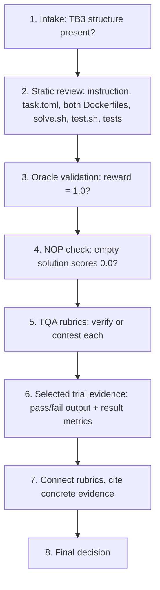

# Terminal Bench 3.0 — Task Review Workflow

A working guide to the reviewer role, distilled from `t30EvalProcess.pdf`.

This is the master review document. The callable instructions in
`.github/skills/code-review/SKILL.md` are derived from it. When this workflow
changes, update that skill to match. Invoke the skill manually when starting a
review.

---

## What you're reviewing

You're a human reviewer for **Terminal Bench 3.0 (TB3)** tasks. A TB3 task is a benchmark problem for coding agents. Each one is a folder with a fixed shape:

- `instruction.md` — the prompt the agent sees (the "contract")
- `task.toml` — metadata, artifacts, timeouts, difficulty/solution/verification explanations
- `environment/` — the Dockerfile for the container the agent works in
- `solution/` — `solve.sh`, the reference ("oracle") solution written by the task author
- `tests/` — the verifier: its own Dockerfile, `test.sh`, and test code

Your deliverable is not a fix to the task. It is a saved Markdown report with
**49 evidence-backed rubric ratings, one for every rubric, plus a final task
decision**. Write it to `code-review/out/<task>.human-review.md`. Task authors
then use the report to make the task shippable.

The single idea behind every rubric: a good TB3 task must be **hard enough that strong agents genuinely fail, but fair enough that when they fail it's the agent's fault and not the task's**. Almost everything you check is either "is it real work?" or "is the grading honest?"

---

## The review roles

The report must keep these layers separate:

| Layer | What it contains | How to use it |
| --- | --- | --- |
| **TQA review** | TQA's original PASS, FAIL, LOW, MOD, or missing result and its explanation for each rubric. | Report what TQA checked. Point out wrong or unsupported claims in the reason. Do not invent a second TQA decision field. |
| **Reviewer Agent review** | A separate automated review of the same task. It is not more authoritative than TQA and is not part of the portal decision rule. | Read it as an optional source of leads. Check useful leads against primary evidence. Do not use its statements as evidence or put them inside criterion blocks. |
| **Human review** | Your audit of each TQA criterion against the rubric and primary task evidence. | Give each rubric a `PASS`, `FAIL`, `LOW`, or `MOD` rating as appropriate. Reserve `ACCEPT` or `REJECT` for the final task decision. |

The 49 human decisions follow one chain: TQA finding, rubric definition,
primary task evidence, human decision. Primary evidence means the instruction,
task files, tests, oracle and control results, and selected trial results. The
Reviewer Agent may suggest a check, but its statement is never proof and must
not change a decision unless the primary evidence independently establishes the
same issue. Never use agent agreement, disagreement, confidence, or silence as
a voting mechanism.

Before reviewing the six evidence groups, skim the Reviewer Agent report and
make a short internal lead list. A lead should name a concrete file, test,
behavior, metric, FP/FN risk, or instruction mismatch worth checking. Do not
copy its conclusions into the human review. As primary evidence is inspected,
mark each relevant lead `confirmed`, `refuted`, or `not checked`:

- `confirmed` means primary evidence independently proves the claim. It may
  affect a human decision, but cite the primary evidence rather than the agent.
- `refuted` means primary evidence contradicts the claim. Do not use it.
- `not checked` means it was not needed or the prepared evidence could not
  settle it. It must not affect a human decision.

Reviewer Agent leads are a coverage aid. They can change what the human checks,
but they cannot directly change what the human marks.

---

## The evidence you review

Prepare the evidence once:

```bash
cd code-review
npm run prepare-review -- inbox/<package-or-parent>
```

After that command finishes, review only these outputs:

```text
code-review/out/
  <task>.dossier.md
  <task>.reviewer-agent-findings.md      when present in the package
  <task>/
    reviewer-working-copy/
      instruction.md
      task.toml
      environment/
      solution/
      tests/
    trajectories/
      <model>/
        attempt_NN-pass/
        attempt_NN-fail/
          verifier/test-stdout.txt
          verifier/reward.txt
          result.json
```

The trajectory export keeps one passing attempt per model and every failing attempt. Its `result.json` contains only `agent_result` and `verifier_result`. It does not contain the agent's step-by-step trajectory.

### Review boundary and context budget

The preparation command is the only step allowed to receive an `inbox` path. After it finishes, the evidence boundary is the generated files for that task under `code-review/out/`.

- Do not list, search, open, or inspect `code-review/inbox/`, raw trajectory folders, `harbor-view/`, `run/`, or any other evidence source outside `code-review/out/`.
- Do not load, attach, summarize, or recursively read the entire `out/` folder or the entire task output. Open only the file needed for the current check.
- Do not start with a broad recursive search. Read the dossier headings first. Then open the relevant task file, test, or selected attempt for the current evidence group.
- Read test files one at a time. Follow a concrete assertion or claim to its source instead of loading every file at once.
- Skip duplicate, generated, and unrelated files. A file's presence does not make its contents relevant.
- Treat `data/`, `input/`, `inputs/`, datasets, fixtures, and large artifacts as metadata-only by default. List names, paths, sizes, or schemas when needed. Do not read their contents during the normal review.
- Open data or input content only when a specific criterion cannot be decided otherwise. State the exact edge case first. Read the smallest useful sample or range, never the whole large file.
- Never load binary data or a large data file into model context. Use metadata, a bounded sample, or a targeted structured query.
- Inventory and open every non-data task file. This includes all root files and
  every source, script, note, configuration, and text document under
  `solution/`, `environment/`, and `tests/`. Review each file for every rubric it
  can affect, not only leakage. Suspicious filenames affect review order only;
  they never limit the files inspected.

A normal review should read the dossier selectively, the small task source files needed by the current group, each relevant test, and the retained pass/fail outputs. Context size is not evidence quality.

The four artifacts that do most of the work:

- **The dossier** — all 49 TQA criteria, TQA reasoning, measured trial facts, and failure summaries.
- **The reviewer working copy** — the instruction, task metadata, environment, oracle solution, and verifier files.
- **Reviewer Agent findings** — when present, the complete Reviewer Agent report, copied without rewriting it.
- **Compact trial evidence** — selected pass/fail rewards, verifier output, and result metrics.

> **Evidence rule:** audit the TQA explanation against the rubric and primary
> evidence. Combine the instruction/spec, task files, test behaviour, oracle
> result, controls, selected trial results, and verifier output. Reviewer Agent
> statements are secondary leads, not evidence for a human decision.

---

## The end-to-end loop



1. **Intake and basic structure review** — confirm `instruction.md`, `task.toml`, `environment/`, `solution/`, `tests/` are all present. Check naming and artifact declarations. Build the agent-visible file inventory and perform the solution-leakage audit below. Do not limit this to obvious test or solution filenames.
2. **Static and configuration review** — read `instruction.md`, `task.toml`, both Dockerfiles, `solve.sh`, `test.sh`, and the test code. Check path declarations, metadata, timeout/resource settings, separate-verifier configuration, and dependency placement.
3. **Oracle validation** — a valid task completes successfully at **reward = 1.0**. If the batch run fails, fail the rubric and reject the task, but still review the remaining rubrics so the author gets a complete report.
4. **NOP / empty-solution sanity check** — a non-trivial task must not pass without doing the work. If NOP passes, the verifier is suspect: investigate whether it's vacuous, always-passing, or otherwise weak.
5. **TQA review and contesting** — review each rubric against the task and evidence. Contest a failure *or a pass* when the explanation is hallucinated, incorrect, unsupported, or stricter than the actual TB3 requirement. Record exact evidence for every contest.
6. **Selected trial review** — `test-stdout.txt` tells you which assertion broke. Compare that assertion with the test code and instruction. Use the retained passing attempt as a control. The compact export does not show the agent's steps, so do not claim what the agent thought or implemented unless another retained file proves it.
7. **Reviewer Portal write-up** — treat rubrics as connected: an instruction gap lowers clarity, lowers coverage, and can create FP/FN issues. Point to concrete evidence and line references.
8. **Final decision** — accept only when solvability, verifier quality, task quality, anti-cheat properties, and the evidence-supported review are all sound.

---

## Pre-review checks

- Task is in TB3 shape: artifacts at the top level and `[verifier].environment_mode = "separate"`.
- `instruction.md` uses **absolute paths**, states every output/path the tests depend on, and has no hidden requirements.
- `environment/Dockerfile` contains only task-runtime dependencies and setup. It must not expose tests, solution files, ground truth, or test-only scoring dependencies.
- `tests/Dockerfile` owns the verifier environment, pre-installs verifier dependencies, and creates parent directories for declared artifacts.
- `tests/test.sh` executes deterministically and writes `reward.txt` **after** verification, not pre-emptively.
  - **The reward file/value generation must happen in `test.sh`, not in `test_outputs.py`.**
- The oracle computes the answer from the task rather than hardcoding or copying a final answer.

### Agent-visible solution-leakage audit

This check is mandatory. A clean Dockerfile is not enough. Inventory everything
the agent can read at task start by tracing every `COPY`, `ADD`, generated file,
mounted input, and pre-existing work-directory file from `environment/Dockerfile`
and the prepared environment tree.

Open and inspect every agent-visible non-data file, regardless of its name or
extension. This includes root files, source, notes, reports, helpers, examples,
configuration, generated text, and anything copied from `solution/`,
`environment/`, or elsewhere into the agent image. Names such as `prior_*`,
`analysis*`, `analyst_notes*`, `notes*`, `reference*`, `expected*`, `answer*`,
and `solution*` are search hints only. They do not define the scope. An ordinary
filename can contain the same leak.

Compare every agent-visible non-data file with the instruction, oracle, and
verifier. Check for:

1. near-complete algorithms, canonicalization or reconciliation logic;
2. hidden output keys, schemas, expected values, constants, or bucket rules;
3. comments that identify remaining bugs or the exact fixes needed;
4. copied oracle functions or verifier-specific edge cases;
5. intermediate outputs that let the agent reconstruct the answer without doing
  the intended work.

For each leak, state the agent-visible path, what knowledge it reveals, how much
of the intended reasoning it replaces, and which shortcut it enables. Files
such as `/app/prior_analysis.py` and `/app/analyst_notes.md` are blocking leaks
when they expose near-complete logic, hidden output keys, or the remaining
fixes. This affects anti-cheat robustness (#3), shortcut resistance (#9), core
challenge (#13), no extraneous files (#32), and false-positive protection (#40)
as applicable.

The prepared review evidence must include the complete agent-visible file list
and every text file copied into the agent image. If it does not, record a review
preparation gap and do not claim that leakage checks passed. Missing prepared
evidence is not itself proof that the task leaks, but it prevents an `ACCEPT`
based on an assumed clean environment.

### Full non-data source audit

Leakage is one part of the review, not the only reason to inspect files. Open
every non-data file in the prepared task working copy:

- root files, including the instruction, task metadata, READMEs, notes, and
  helper documents;
- every file under `solution/`, including `solve.sh`, implementation files,
  helper modules, templates, and generated text;
- every file under `environment/`, including the Dockerfile, setup scripts,
  copied source, notes, and non-data assets;
- every file under `tests/`, including the Dockerfile, `test.sh`, test modules,
  helpers, configuration, and non-data fixtures.

Classify each file by the rubrics it can affect. For example, solution files can
affect oracle honesty, hardcoding, determinism, and leakage. Environment files
can affect agent visibility, dependencies, reproducibility, safety, and runtime
behavior. Test files can affect alignment, coverage, FP/FN, anti-cheat, reward
handling, and failure attribution. Root notes and helpers can affect
specification, extraneous files, leakage, difficulty, and shortcuts.

Skip the contents of `data/`, `input/`, `inputs/`, datasets, and large fixtures
by default. Still inspect their names, paths, sizes, schemas, generation code,
and how source or tests consume them. Read a bounded sample only when a concrete
criterion or edge case requires it.

### `test.sh` reward control flow

Read `tests/test.sh` in execution order. Check all three cases:

1. **Pre-emptive reward generation is a hard fail.** If the script writes a default reward before pytest, such as `echo 0 > /logs/verifier/reward.txt`, mark Reward File Written Correctly as FAIL. A timeout should remain an `AgentTimeoutError`. A pre-written zero hides that timeout and makes it look like a normal test failure.
2. **`set -e` must not skip reward generation.** If `set -e` is active when pytest runs, the script must disable it with `set +e` or use another explicit construct that captures pytest's exit code. Otherwise, a failed test exits the script before `reward.txt` is written. Harbor then reports `RewardFileNotFound`, which hides the actual test result.
3. **Write the reward before the final exit.** The script may end with `exit 0` or with pytest's captured exit code. Either form is acceptable only after `reward.txt` has been written from the completed test result. The shell exit code does not replace the reward file.

For every finding, name the pytest invocation, reward write, and final exit.
Explain their order and effect. Do not make the reader follow line numbers to
understand the problem.

---

## File-by-file review

**`instruction.md`** — clear objective, absolute paths, expected outputs/formats, no hidden requirements, concise and human-written. Every tested behaviour should be traceable back to it. Missing requirements later asserted by tests are a **major alignment issue**.

**`task.toml`** — required metadata, top-level artifacts, separate verifier, resources/timeouts, valid category/tags, relevant experience, no invented fields. Artifacts must match what the verifier actually needs, and the timeout stated in the instruction must match the configured timeout.

**`environment/Dockerfile`** — only runtime dependencies and start state; apt hygiene; no test/solution leakage; no ground truth. Any verifier or test asset visible to the agent is a leakage/anti-cheat concern.

**`tests/Dockerfile`** — verifier dependencies installed at build time, tests copied into `/tests`, artifact parent directories created. Missing artifact directories cause upload failures; trial-time installs make verification flaky.

**`tests/test.sh` + tests** — deterministic execution, behaviour-based checks, complete instruction coverage, robust edge cases, reward emitted correctly. Avoid keyword/source grepping, hidden requirements, brittle exact-value checks, and tests that mirror one implementation.

**`solution/solve.sh`** — the reference solution derives the answer; helper scripts belong in `solution/`; the oracle is deterministic and idempotent. A hardcoded answer or copied fixture is a major solvability/oracle-quality concern.

---

## What the 49 rubrics are actually asking

Do not review them as 49 isolated tasks. Review six evidence groups. Decide the connected criteria together, then name the criterion numbers and IDs covered by each conclusion.

**Is it solvable and is the oracle honest?**
Oracle reaches reward 1.0 (#1), fits the configured time (#5), and *derives* the answer rather than pasting or hardcoding it (#19). Solution produces an outcome the verifier can deterministically validate (#35).

**Is the verifier strong?**
Empty solution fails (#2). Verifier resists adversarial agents (#3) and tests resist shortcuts like copying, hardcoding, or exploiting a test gap (#9). No false positives (#40). No reward-hacking path (#44). Verifier runs in a **separate container** and receives only intended artifacts (#31). `reward.txt` written at the correct point, reflecting the real test result, never pre-emptively (#38) — a pre-written reward can mask timeouts and harness failures.

**Is the grading fair?**
Every test assertion traces to the instruction (#14). The instruction is complete, precise, and free of solution hints (#33), and the task specification gives a capable agent enough information to succeed (#43). Tests grade outcomes, not process (#8), and verify behaviour through **execution** rather than grep/string matching/source scanning (#11). No false negatives from mismatched names, brittle assertions, or spec defects (#41). Adequate coverage of instructed behaviours and meaningful edge cases (#34). Observed failures attributable to the agent, not infra (#42). No typos in identifiers/paths/commands (#21). Timeouts and resources appropriate (#27), with no failures caused purely by low timeout (#48).

**Is the difficulty the right kind?**
Genuinely difficult (#6), difficulty coming from the intended domain challenge rather than formatting or infrastructure accidents (#13), with the crux conceptual and central (#45) and non-clerical (#49). Near misses should be honest capability failures, not almost-correct outputs rejected over minor formatting (#46). Not memorizable from training data (#15). Requires real agent interaction (#16). Interesting / real-world (#7). Plausible expert time estimate (#29).

**Is it clean and deterministic?**
Verifier deterministic and reliable (#4). Task, oracle, and verifier reproducible across runs (#12). Docker/environment hygiene (#39). No extraneous or pre-baked runtime files (#32). Correct task directory structure (#37). `task.toml` follows the Harbor schema, using only required fields in correct sections (#30). Declared input artifacts genuinely contain the conditions or defects the task expects (#36).

**Is it well documented and safe?**
The three `task.toml` explanation fields each have a distinct job: `difficulty_explanation` covers intrinsic difficulty and real-world context (#22); `solution_explanation` gives high-level strategy and insight, **not** a line-by-line script dump (#23); `verification_explanation` says what the tests check, why, and any tolerance choices (#24). Plus meaningful category and tags (#25), a descriptive slug following the 3-word naming constraint (#26), a README that adds context without leaking the solution (#28), reviewability by non-specialists (#17), a concise human-written instruction free of tutorial content (#18), structured output used where it genuinely helps with a clearly specified schema (#20), no malicious or unsafe content (#10), and no unexpected agent refusal patterns (#47).

---

## Rubrics that need extra attention

These carry the most weight because a failure in one cascades into clarity, coverage, FP/FN, or verifier-quality problems elsewhere.

- **Core Challenge is the Actual Problem** — confirm the task is difficult for the intended technical reason, not formatting, ambiguity, or infrastructure noise. Check the failing assertion and compare it with the task's stated crux.
- **Tests Align with the Instruction** — every assertion traceable to the contract. Any test-only requirement is a major alignment issue; a spec/test mismatch can cascade into many rubric failures.
- **Instruction Quality** — the agent must have objective, paths, outputs, formats, and constraints. Missing or ambiguous requirements are a common FP/FN root cause.
- **Test Coverage** — essential behaviours and meaningful edge cases covered; look for important paths that can pass untested.
- **Reward File Written Correctly** — written during verification, reflecting the real result, not created pre-emptively in a way that masks timeouts or harness failures.
- **False Negative** — a correct solution must not fail from a spec/test defect. Confirm with the failing assertion, instruction, test code, and retained trial result.
- **False Positive** — an incorrect solution must not pass from weak or missing assertions. Look for untested paths, hardcoding opportunities, and exploitable gaps. Use the retained passing output as a control, not as proof that every wrong solution fails.
- **Task Specification** — enough information to succeed without hidden conventions that appear only in tests.
- **Difficulty Crux** — failures should reflect the intended conceptual challenge, not clerical work or environmental friction. Count how many failed trials are explained by each ambiguity, mismatch, or intended domain error.
- **Near Misses / Non-Clerical Difficulty** — near-misses should be genuine capability failures, not almost-correct outputs rejected over minor formatting.

> **Tip:** when one of these fails, check whether the same root cause affects another rubric before writing the final decision.

---

## The FP/FN judgement — the heart of the job

False positives and false negatives are the core of every review. They decide whether the verifier grades the task honestly. Structure, Docker hygiene, reward handling, and coverage still matter, but they are secondary to whether correct work passes and wrong work fails.

- A **false negative** means the verifier rejects a solution that follows the
  written instruction. Explain the exact compliant behavior, the test that
  rejects it, and why the instruction allows it.
- A **false positive** means the verifier accepts a solution that does not do
  the required work. Explain the exact wrong implementation, the tests it still
  passes, and which required behavior those tests never exercise.

Do not report "none" for either category until every test and every assertion has been checked. For each assertion, ask both questions:

1. What incorrect result could satisfy this assertion?
2. What correct result could this assertion reject?

Write every FP/FN finding so a colleague can repeat the explanation without
opening the whole report. Use this order:

1. **Expected behavior:** say what the instruction requires or permits.
2. **Verifier behavior:** name the test function and assertion or comparison.
3. **Concrete counterexample:** describe the wrong solution that passes for an
  FP, or the compliant solution that fails for an FN.
4. **Why the result is wrong:** connect the counterexample to the missing,
  over-strict, or mismatched check.
5. **Proof level:** say whether a selected attempt demonstrates it or whether
  source inspection proves only that the path is possible.
6. **Fix:** state the smallest test or instruction change that closes the gap.

Do not stop at "hardcoding can pass" or "a correct solution can fail." Name the
values that could be hardcoded, the inputs the verifier never varies, the extra
field or valid format it rejects, and the test function responsible. If the
evidence cannot support that detail, do not claim an FP or FN. Record what
evidence is missing and rate the rubric only from what primary evidence proves.

1. For every TQA grading, read the description and compare it with task intent. Do not accept the label automatically. Hallucinated claims or conditions stricter than the actual TB3 requirement are **contest candidates** — record the exact reason.
2. For a model failure, inspect `test-stdout.txt` to identify which assertion failed. Then inspect the corresponding test code and `instruction.md`.
3. Compare failing and passing `test-stdout.txt`, `reward.txt`, and the reduced `result.json`. State only what those files prove. Do not infer unseen agent steps.
4. For FP/FN comments, name the relevant instruction section, test case, and
  assertion or comparison. Name the trial naturally as described below.

> **Decision principle:** a test can be technically correct but still wrong for the task if it enforces an unstated requirement. Conversely, an agent can fail a test legitimately even when the test is well written. The correct classification comes from **contract + test + observed verifier result together**.

---

## Writing review comments

Keep TQA, Reviewer Agent, and human review separate. Base the 49 human decisions
only on the TQA criterion, its rubric definition, and primary task evidence.
Support each decision with concrete evidence and state a fix when the rating is
not `PASS`.

The finding work and the writing work are separate jobs. A correct finding
written at four times the needed length reads as machine output, and the reader
rejects the presentation before judging the finding. Write the way a senior
reviewer fills in a form: state the finding, show the number, stop.

### Voice

- Two or three short sentences per point. If two sentences settle it, do not
  write five.
- No process narration in the criterion blocks. Do not write "I read", "I
  opened", "I diffed", "I traced the whole reward path", or "I checked every
  assertion". Say what the file or test does. Keep "I" for the final block,
  where a judgement is being owned.
- No colour and no rhetorical flourish. Write "the difference was 0.0004 against
  a 0.0001 bound". Do not write "four hundredths of one cent" or "within 30
  centimetres on a 30 kilometre leg". Translate a number into task units once,
  where it first matters, and never repeat that phrasing later.
- No sub-headings inside `Reason`. Do not write "What the contract permits:",
  "The compliant solution that fails:", or "Why the result is wrong:". Those are
  thinking scaffolds, not prose.
- No hedging pairs such as "well built and worth shipping once the precision
  contract is closed". Give the rating and the reason for it.
- Plain declarative sentences. "The instruction requires X. It never states Y.
  The verifier enforces Z. All eight trials failed on Z."
- Do not use em dashes.
- Use plain words. Write "use", not "utilize". Write "about", not "regarding".
- One fact, one place. When a single defect explains four rubrics, write it in
  full under the rubric it belongs to and refer back to it in one sentence
  elsewhere. Do not restate the same margin, trial count, and analogy in six
  blocks.
- Write for a leadership reader with no code context. Explain a technical term
  the first time it appears.
- Do not write vague findings such as "tests are weak" or "instruction is
  unclear" without naming the exact mismatch.

### Length limits

| Field | Limit |
| --- | --- |
| `Reason`, PASS | 2 to 4 sentences |
| `Reason`, FAIL / LOW / MOD | 6 short sentences, or up to three short paragraphs when a formula and a counter-example are both needed |
| `Evidence` | at most 3 bullets, one line each |
| `Required fix` | one sentence |

Long is not thorough. When a block runs past the limit, the extra text is almost
always process narration, a repeated number, or a restated analogy. Cut those
first.

### What still has to be in the sentences

The limits above tighten the writing, not the content. Every short block still
carries these:

- Instruction section names, test names, function names, variables, commands,
  and file names. No numeric line ranges. The explanation stands on its own so
  the reader does not have to open the file.
- What the task asks, what the solution or verifier does, and why that behavior
  passes or fails. State the problem before naming the file.
- A number's meaning in task terms, with its denominator or impact. Give it once.
- For an instruction or specification defect: where the gap sits in the flow of
  the instruction, described in words, what the later test or output depends on,
  and why an agent cannot resolve it uniquely.
- For alignment, coverage, FP, and FN findings: what the instruction permits,
  which named assertion accepted or rejected the result, and the concrete wrong
  pass or wrong failure. Vary the wording. Do not start every sentence with
  "the instruction asked" or "the agent did".
- For Difficulty Crux, Near Misses, False Negatives, and Failure Attribution:
  the affected trial count with its denominator, such as "8/8 Codex trials
  passed 11 of 12 tests". Separate clean ambiguity-caused failures from
  independent agent mistakes.
- Trials in natural English. Prefer a real trial ID. Otherwise write "the third
  Codex trial", never `attempt_03-fail`.
- Reviewer Agent claims only in the separate notes section, referred to by the
  claim itself, not by the findings file path.

### Write every Reason so it can be lifted verbatim

The final review is not composed a second time from scratch. Take the blocks
rated `FAIL`, `LOW`, or `MOD`, keep the same wording, and paste them under
`My Analysis`. If a `Reason` cannot be pasted into a leadership summary as
written, it is written wrong. Fix it in the criterion block, not in the summary.

### How it should read

Too long, and the finding is buried:

> I checked every assertion for what wrong answer could satisfy it, and the
> numeric ones are well protected. `test_global_agreement` compares all four
> fields on all ten invoice lines against the reference, so a partially correct
> audit fails. Hardcoding is not a viable shortcut, because the expected numbers
> are not readable anywhere in the agent image and no verifier feedback reaches
> the agent during the run. The one real gap is the one TQA named, and I
> confirmed it against the sources.

Right:

> The instruction requires agents to repair and execute the `deadaudit` service
> twice. The verifier never runs or imports the submitted service. It only reads
> `audit.json` and `audit_run2.json`. Manual testing submitted two static
> expected JSON files with no service implementation. All 12 tests passed and
> reward 1 was awarded.

Another pair. Too long:

> A second, latent false negative sits in `test_global_agreement`. The allowable
> distance is accepted within 2 percent, but `overbilled_usd` is capped at one
> dollar absolute. On INV-003, billed 80.0 km at 1.50 usd per km with an
> allowable near 40 km, 2 percent is 0.8 km, which is 1.20 dollars and therefore
> outside the dollar bound. No trial hit this; I found it by reading the two
> assertions together.

Right:

> `test_global_agreement` accepts the allowable distance within 2 percent but
> caps `overbilled_usd` at one dollar. On the 80 km invoice lines, 2 percent of
> the distance is worth more than a dollar, so the two tolerances disagree and a
> solution inside the stated distance tolerance is rejected. No recorded trial
> failed this way, so it is a false-negative risk and not trial-confirmed.

### Document structure

Write six short evidence-group conclusions first, three or four sentences each.
Each conclusion names the criteria covered and records the shared checks once.
Then add a `## Criterion decisions` ledger with one numbered subsection for each
criterion from 1 through 49 in strict numeric order. Each subsection must tell
the human reviewer what portal mark to enter. Use this exact field structure:

```
### <number>. <criterion name> (`<criterion_id>`)
TQA review: <TQA's original result and a short account of what it checked>
Human rating: <PASS|FAIL|LOW|MOD>
Reason: <plain explanation of why this rubric receives that rating>
Evidence:
  - <primary evidence described by behavior, section, test/function/variable name, measured fact, or naturally named trial>
Required fix: <only for FAIL, LOW, or MOD; omit for PASS when no change is needed>
```

`TQA review` reports TQA's work. If its label or reason is wrong, explain the
problem in `Reason`; do not add a second verdict about TQA. `Human rating` is
your own rubric result. Use `PASS`, `FAIL`, `LOW`, or `MOD` according to the
rubric's normal vocabulary. Do not use `ACCEPT` or `REJECT` on individual
rubrics. Reserve those words for the final task decision. Missing exported
evidence does not by itself prove that the task fails. Record the evidence gap
separately and use other primary evidence or TQA's measured result when it is
sufficient. Never use a Reviewer Agent statement to break a tie. The group
conclusions do not replace the 49 numbered blocks.

After the 49 blocks, add `## Reviewer Agent notes` when that report exists. Keep
it to at most six one-line bullets. Each bullet names the claim and its status:
confirmed, refuted, or not checked. One closing sentence says the notes did not
decide any human rating. No paragraphs.

### The final block

After number 49, append the final `Review:` block below. Save the complete plain
Markdown document to `code-review/out/<task>.human-review.md`. Do not leave the
deliverable only in chat. Do not create a canvas, web page, dashboard,
interactive app, or other presentation layer.

```
Review:

TQA Status: <what TQA marked, then the key metrics in one or two sentences: solve counts per model, oracle, no-op and cheat rewards, infra errors, and the common trial pattern>
Reviewer Agent Status: <its verdict and the reason it gave, in one or two sentences>

My Analysis:

<Failed rubric name / second rubric name when one root cause spans both>: <FAIL|LOW|MOD>

<the same wording as that criterion's Reason, in two to four short paragraphs>

<repeat for each failed rubric group, in portal order>

Final Verdict: <Accept|Reject>

<two or three sentences: what TQA and the Reviewer Agent concluded, the blocking defect, and the decision>

Fix: <the concrete changes, listed in one or two sentences; omit when accepting>
```

Rules for the final block:

- Include only rubrics rated `FAIL`, `LOW`, or `MOD`. Never list passing rubrics.
- Use the rubric's portal name, not its id. Join rubrics with `/` when one defect
  causes both, for example `Task Specification / Instruction Quality` or
  `Tests Align with Instruction / No False Negatives`.
- Reuse the criterion block wording. Do not paraphrase it into a new voice.
- Separate what a trial proved from what only source reading shows. State it
  plainly: "No recorded trial failed through these paths, so they are
  false-negative risks but not trial-confirmed."
- Report manual verifier testing as its own short paragraph when it was done.
  Say what was submitted, which tests passed, and what reward came back.
- Close with one `Fix:` line that lists the changes. Do not narrate them and do
  not restate the analysis inside the fix.
- Do not repeat all 49 decisions.

Before delivery, check the saved file mechanically. It must contain exactly 49
numbered criterion headings, numbers 1 through 49 with no gaps or duplicates,
and one final `Review:` block. Then re-read the failed blocks and the final
block against the voice rules and cut any sentence that narrates your process,
repeats a number already given, or restates an analogy. Tell the user the saved
file path.

**Worked example — False Negative: FAIL**

> All eight Codex trials wrote three-decimal output: `overbilled_km` 0.022 and
> `overbilled_usd` 0.026. At that precision 0.022 x 1.2 rounds to 0.026, and the
> instruction does not prohibit rounding.
>
> `test_arithmetic_consistency` requires the emitted USD value to sit within a
> hidden 1e-4 of the unrounded product. The submitted difference was 0.0004, so
> all eight trials failed while passing the other eleven tests. These are clean
> false negatives caused by an unstated precision requirement.

---

## Final QA gate

Accept only when **all** of the following hold:

- [ ] Oracle passes with reward = 1.0.
- [ ] NOP / empty solution does not pass a non-trivial task.
- [ ] No test or solution leakage into the agent environment.
- [ ] All verifier tests trace to the instruction/spec and grade behaviour, not a single implementation.
- [ ] No material false positives or false negatives remain; any edge case is supported by task, test, and selected trial evidence.
- [ ] Reward is generated correctly and cannot mask timeouts or harness errors.
- [ ] Difficulty is conceptual, realistic, and appropriate, not artificially clerical.
- [ ] Metadata, Dockerfiles, artifacts, paths, timeouts, and task structure meet TB3 requirements.
- [ ] Review comments clearly describe evidence and the required fix.

**Note:** the Reviewer Agent verdict is independently validated against the task and evidence. Any invalid or unsupported verdict by the Reviewer Agent must be explicitly mentioned in your review.
